## 简介

Docker 企业版 (Docker EE) 是 Docker Inc 推出的旨在用于整条软件供应链的企业容器平台。它是一种完全集成的解决方案，用于基于容器的应用开发、部署和管理。借助集成的端到端安全性，Docker EE 通过对您的基础架构进行抽象，使应用可以无缝地从开发转入生产，从而实现了应用的可移植性。

## 您将学到的知识

此参考架构描述了一种标准的生产级 Docker EE 部署。它还详细说明了 Docker EE 的各种组件，包括它们如何工作，如何自动化部署，如何管理用户和团队，如何为平台提供高可用性，以及如何管理基础架构。

将不会提供某些特定于环境的配置细节。例如，各种云平台和本地部署基础架构上的负载均衡器有很大差异。对于这些类型的组件，提供了对于特定于环境的资源的一般指导原则。

## 了解 Docker 组件

从开发到生产，Docker EE 为本地部署的以及云端的容器化应用提供了无缝的平台。Docker EE 分为三个级别，以满足不同的应用需求。Docker EE 标准版（原名 Docker Datacenter）和 Docker EE 高级版都包含下列组件：

* Docker EE 基础版（原名“商业支持版”或“CS”引擎），即商业支持的 Docker 容器运行时和平台
* Universal Control Plane (UCP)，基于 Web 的统一集群和应用管理解决方案
* Docker Trusted Registry (DTR)，具有弹性的安全镜像管理仓库

它们合在一起提供了一套集成解决方案，其设计目的如下：

* 敏捷性 ― 使用 Docker API 与平台对接，确保可运作的功能不会拖慢应用交付速度
* 可移植性 ― 平台将用于应用的基础架构的详细信息进行抽象
* 控制 ― 环境在默认情况下是安全的，提供鲁棒的访问控制，以及所有操作的日志记录

为了实现这些目标，平台必须具备弹性和高度的可用性。此参考架构演示了这种鲁棒的配置。

### Docker EE 基础版

Docker EE 平台负责容器级别的操作，与 OS 进行交互，提供 Docker API，并运行 Swarm 集群。该引擎也是包括 OS 资源、联网和存储在内的基础架构的集成点。

### Universal Control Plane

UCP 通过提供集成的应用管理平台来扩展 Docker EE 基础版。它既是用户的主要交互点，也是应用的集成点。UCP 在集群中的所有节点上运行代理程序来监视它们，并且在*控制器节点*上运行一组服务。这些服务包括用于管理用户的*身份服务*，用于用户和集群 PKI 的*认证中心* (CA)，提供 Web UI 和 API 的主*控制器*，用于 UCP 状态的数据存储，以及用于向后兼容的*经典 Swarm* 服务。

### Docker Trusted Registry

DTR 是一种由 UCP 管理并与其集成的应用，提供 Docker 镜像分发和安全服务。DTR 使用 UCP 的身份服务提供单点登录 (SSO)，并建立相互信任，从而与其 PKI 集成。它以一组服务的形式运行于一个或多个*从节点*，其中包括用于存储和分发镜像的*镜像库*、镜像签名服务、Web UI、API 和用于镜像元数据和 DTR 状态的数据存储。

### Swarm Mode

为了提供基于若干节点的无缝集群，DDC 需要依靠 Docker [*swarm mode*](https://docs.docker.com/engine/swarm/key-concepts/) 功能。Swarm mode 将节点分为*工作节点*（运行定义为服务的应用工作负载的节点）和*管理节点*（负责维护所需状态、管理集群的内部 PKI 和提供 API 的节点）。管理节点也可以运行工作负载。在 Docker EE 环境中，它们运行的是 UCP 控制器，而不应该运行其他任何项目。

Swarm mode 服务模型为工作负载提供一种声明式所需状态，可扩展到若干个*任务*（服务的容器），可以通过稳定的可解析名称访问，而且可以选择暴露端点。可以从任何节点在全集群保留端口上访问暴露的服务，它们通过*网格路由*（使用 Linux 内核中的高性能交换的快速路由层）与任务通信。这一组功能实现了服务的内部和外部可发现性，UCP 的 *HTTP 网格路由* (HRM) 则添加了主机名到服务的映射。

## 一种标准部署架构

本节演示 Docker EE 的一种标准生产级架构，它使用 10 个节点：3 个 UCP 控制器，3 个用于 DTR 的节点，以及 4 个用于应用工作负载的工作节点。工作节点的数量是任选的，大多数环境会根据应用需求增加工作节点数量，这不会改变架构或集群配置。

对环境的访问是通过 3 个负载均衡器（或 3 个负载均衡器虚拟主机）实现的，它们有与 UCP 控制器、DTR 从节点和集群中运行的应用对应的 DNS 条目。

DTR 从节点使用共享的镜像存储。本节中会论述与 S3 兼容的对象存储（默认）以及 NFS 存储。

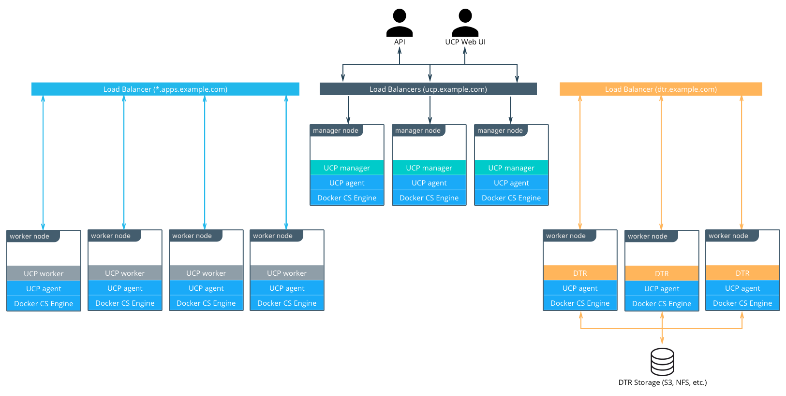

### 节点大小

一个节点就是集群（虚拟或物理）中的一台运行 Docker 引擎的机器。在配置每个节点时，都要给它分配一个角色：UCP 控制器、DTR 或工作节点，从而使它们受到针对运行中的应用工作负载的保护。

要在 CPU、RAM 和存储资源方面确定节点应有的大小，请考虑下列因素：

1. 所有节点都应该至少达到 UCP 2.2 的最低要求：2 GB RAM 和 3 GB 存储空间。更详细的要求请参见 [UCP 文档](https://docs.docker.com/datacenter/ucp/2.2/guides/admin/install/system-requirements/)。
2. 应该为 UCP 控制器节点提供高于最低要求的资源，但如果这些节点上不运行其他任何项目，则不必分配太多资源。
3. 理想的工作节点大小将根据您的工作负载而定，所以定义通用的标准大小是不可能的。
4. 其他考虑因素包括目标密度（平均每个节点的容器数量）、需要一种标准节点类型还是多种类型，以及可能影响大小选择的其他运行考虑。

如有可能，应该通过试验和实际工作负载测试来确定节点大小，而且应该通过反复迭代来优化。下列做法是很好的起点：在您的环境中选择一种标准或默认的机器类型，并且仅使用这种机器的大小。如果标准机器类型提供的资源多于 UCP 控制器的需求，那么就应该为这些节点选择更小的节点大小。无论最初的选择是什么，务必监视资源使用情况和成本以改进模型。

两种示例方案：

* 一种标准节点大小：2 个 VCPU，8 GB RAM，20 GB 存储空间
* 两种节点大小：2 个 VCPU，8 GB RAM，20 GB 存储空间，用于 UCP 控制器；4 个 VCPU，64 GB RAM，40 GB 存储空间，用于工作节点

根据您选择的 OS，Docker 引擎的存储配置可能需要一些规划。请参阅[支持矩阵](https://success.docker.com/Policies/Compatibility_Matrix)以了解哪些[存储驱动程序](https://docs.docker.com/engine/userguide/storagedriver/selectadriver/)被支持用于您的主机 OS。如果您使用 RHEL 或 CentOS，这一点尤其重要，因为它们使用 [device mapper 及 direct-lvm](https://docs.docker.com/engine/userguide/storagedriver/device-mapper-driver/#/configure-direct-lvm-mode-for-production)。

### 负载均衡器

负载均衡器的配置应该在安装之前完成，包括 DNS 条目的创建。大多数负载均衡器应该都能与 Docker EE 配合工作。仅有的要求是 TCP 透传和在 HTTPS 端点上执行健康检查的能力。

在我们的示例架构中，三个 UCP 控制器确保了在节点发生故障或控制器重新配置时的 UCP 弹性。通过 GUI 或 API 对 UCP 的访问始终是使用 TLS 完成的。负载均衡器配置为在端口 443 上进行简单的 TCP 透传，并使用位于 `https://<ucp_controller>/_ping` 的定制 HTTPS 健康检查。

务必为 UCP 主机创建 `ucp.example.com` 之类的 DNS 条目，并指向负载均衡器。

三个 DTR 从节点的设置与 UCP 控制器的设置类似。在这些节点上同样使用 TCP 透传至端口 443，但健康检查是在 `https://<dtr_replica_node>/health`。

为 DTP 主机创建 `dtr.example.com` 之类的 DNS 条目，并指向负载均衡器。务必使该条目尽可能简洁，因为它将是镜像全名的一部分。例如 `user_a` 的 `webserver` 镜像将名为 `dtr.example.com/user_a/webserver`。

通过应用负载均衡器可访问通过 UCP 的 HTTP 网格路由 (HRM) 暴露的服务 HTTP 端点。HRM 提供一个反向代理，将域名映射到暴露端口且连接到 `ucp-hrm` Overlay 网络的服务。例如 `voting` 应用暴露 `vote` 服务的端口 `80`。HRM 将 `http://vote.apps.example.com` 映射到 `ucp-hrm` Overlay 网络上的此端口，而应用 LB 本身将 `*.apps.example.com` 映射到集群中的节点。

有关 UCP 上的应用负载均衡的更多详细信息，请参见 [Universal Control Plane 2.0 服务发现与负载均衡](https://success.docker.com/Architecture/Docker_Reference_Architecture%3A_Universal_Control_Plane_2.0_Service_Discovery_and_Load_Balancing)。

### DTR 存储

DTR 通常需要存储大量镜像。它使用的是外部存储（S3、NFS 等），而不是节点存储，因此可以在 DTR 从节点之间共享。DTR 在从节点之间复制元数据和配置信息，但不在镜像层本身之间复制。要确定存储大小，请以环境中使用的现有镜像的大小为起点进行调整。

最好使用环境中现有的存储解决方案，使镜像存储能够得益于现有的操作经验。如果您必须选择新的解决方案，请考虑使用与 S3 兼容的对象存储，它会更密切地映射到镜像库操作。

请参阅[用于 Docker CaaS 的存储解决方案简介](https://success.docker.com/Architecture/An_Introduction_to_Storage_Solutions_for_Docker_CaaS)来了解关于选择存储解决方案的更多信息。

## 对于 Docker EE 安装的建议

本节详细说明架构的安装过程，并提供一个核对表。它并不能替代有关文档，后者提供了更多详细信息，从各方面来讲都是权威性的。本节的目标是帮助您定义一个可重复的（最好也是自动化的）过程，用以部署、升级和扩展 Docker EE 环境。

Docker EE 标准版或高级版安装的三个主要阶段如下所示：

1. 部署和配置基础架构（主机、网络、存储）
2. 安装和配置作为应用在主机上运行的 Docker 引擎
3. 安装和配置 UCP 和 DTR，它们作为在引擎上运行的容器而实现

### 基础架构注意事项

[安装文档](https://docs.docker.com/datacenter/install/linux/)详细说明了 Docker EE 标准版和高级版的基础架构要求。建议使用环境中现有的或特定于平台的工具来为基础架构组件提供标准化的可重复配置。

#### 网络

Docker 组件需要通过网络通信，文档列出了为实现内部集群通信[需要开放的端口](https://docs.docker.com/datacenter/ucp/2.2/guides/admin/install/system-requirements/)。如果集群的内部网络配置不当，可能引发难以追查原因的问题。最好先从相对简单的环境开始。此参考架构假定所有主机使用同一个子网，而容器使用 Overlay 网络。

要获取更多详细信息和评估各种选项，请查阅 [Docker 参考架构：设计可扩展、可移植的 Docker 容器网络](https://success.docker.com/Architecture/Docker_Reference_Architecture%3A_Designing_Scalable%2C_Portable_Docker_Container_Networks)。

#### 防火墙

对 Docker EE 的访问只能使用端口 443 进行（对于 DTR 是端口 443 和 80），无论访问 Web UI 还是远程 API 都不例外。因此外部防火墙配置很简单。在大多数情况下，您只需要开放端口 80、443 和 22。端口 22 用于 SSH 访问，因为 Docker EE 不需要 SSH 访问，所以它是可有可无的。对应用的访问是通过负载均衡器使用 HTTPS 进行的。如果您对外界暴露其他 TCP 服务，请在防火墙上开放这些端口。上一节已经说过，为了在集群内部通信，也需要开放多个端口。如果您在集群中的某些节点之间设有防火墙（例如用于分隔控制器与工作节点），那么也要开放相关端口。

如果在应用内部使用经过加密的 Overlay 网络，则还应该允许 ESP（封装安全有效负载）或 IP 协议 50 流量。ESP 并非基于 TCP 或 UDP 协议，它将用于安全有效负载 / 数据的端到端封装。

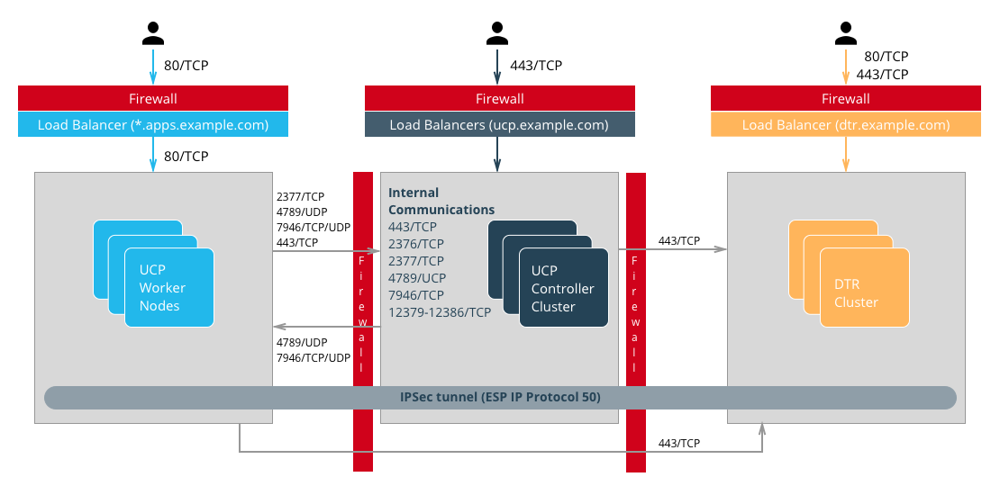

#### 负载均衡器

上一节详细说明了负载均衡器。它们必须在安装之前配置完毕，而且必须有合适的主机名。外部（负载均衡器）主机名用于 HA，也用于 TLS 证书。如果在安装期间或安装后不必重新配置它们，就会比较轻松。

请参阅上一节[了解 Docker 组件](#ddc-components)来获取关于负载均衡器配置的详细信息。

#### 共享存储

用于镜像库中镜像的 DTR 共享存储必须就绪，并且必须可从 DTR 节点访问。请使用 S3 或 NFS 命令行客户端来测试其是否工作，以避免调试 DTR 存储配置的麻烦。

#### 主机配置

主机配置根据所使用的 OS 和现有配置标准而定，不过在安装 OS 之后必须执行几个重要步骤：

1. 使用 NTP 或类似服务进行**时钟同步**。时钟偏差可能导致难以排除的错误，特别是在使用 Raft 算法的情况下（UCP 和 DTR）。
2. 所有主机的 UCP 都需要**静态 IP**。
3. **主机名**用于集群中的节点标识。必须以非临时性的方式设置主机名。
4. **主机防火墙**必须在安装文档中指定的所有端口上允许集群内流量。
5. 如果有需要，还必须配置**存储**。例如，`devicemapper` 驱动程序需要一个在 Docker 引擎安装之前配置的逻辑存储卷。

### Docker EE 基础版安装注意事项

关于 EE 安装的详细说明由[文档提供](https://docs.docker.com/engine/installation/)。要在无法访问互联网的机器上安装，请将这些软件包添加到您自己的私有镜像仓库。安装软件包之后，确保将 `docker` 服务配置为在系统引导时启动。

更改 Docker EE 基础版的参数的最佳方式是使用 `/etc/docker/daemon.json` 配置文件。这样可以确保配置能够方便地跨不同系统和 OS 复用。请参见文档了解[完整的选项列表](https://docs.docker.com/engine/reference/commandline/dockerd/#/daemon-configuration-file)。

启动 `docker` 服务，并使用 `docker info` 验证参数，从而确保引擎配置正确。

### UCP 安装注意事项

UCP 安装程序会从一组运行 Docker EE 基础版的机器创建功能性集群。这包括创建 Swarm 集群和安装 UCP 控制器。在[安装指南](https://docs.docker.com/datacenter/ucp/2.2/guides/admin/install/)中描述的默认安装方式是交互式的。

要执行完全自动化的可重复部署，请对安装程序提供更多信息：

    docker run --rm -v /var/run/docker.sock:/var/run/docker.sock \
      -v /tmp/docker_subscription.lic:/config/docker_subscription.lic \
      -e UCP_ADMIN_PASSWORD=password --name ucp docker/ucp install --host-address IP_or_interface \
      --san manager1.example.com --san ucp.example.com

下列各节会说明所有这些选项。

#### 外部证书

默认情况下，UCP 使用自签名的 TLS 证书。对于生产部署，建议使用由可信的 CA 生成的证书。在大多数情况下，该 CA 就是您的组织的内部 CA。

需要的证书和密钥如下所示：

1. 根 CA 的公用证书 `ca.pem`。
2. TLS 证书 `cert.pem`。它还必须包含所有中间 CA 的公用证书，并有用于访问 UCP 的所有地址的 SAN，包括负载均衡器的主机名（例如 `ucp.example.com`）和各个控制器的主机名（例如 `ucp-controller1.example.com`），以便直接访问它们。
3. TLS 私钥 `key.pem`。

要在安装期间自动添加这些项目，请在您安装 UCP 的机器上，将这些带有正确名称的文件添加到名为 `ucp-controller-server-certs` 的存储卷，并使用 `--external-server-cert` 安装参数。

也可以在安装后通过 Web UI 添加证书。

#### 许可证文件

要为安装提供许可证文件，可以通过命令行，也可以在 `/config` 中使用绑定式挂载（存储卷）。使用 `-v /path/to/docker_subscription.lic:/config/docker_subscription.lic` 指定其位置。

#### 管理员密码

要使安装过程成为完全非交互式的，必须使用 `--admin-password` 安装参数传递管理员密码。默认的管理员用户名是 `admin`。可以使用 `--admin-username` 来更改它。

在[安装命令文档](https://docs.docker.com/datacenter/ucp/2.2/reference/cli/install/#options)中提供了安装参数的完整列表。

#### 添加节点

完成第一个控制器节点的安装后，必须再将两个控制器加入集群，从而完成其安装。UCP 会在集群中的管理节点上配置一个完整的控制器从节点，因此在这两个控制器上只需要执行命令 `docker swarm join` 并使用正确的标记即可。可以通过在第一个控制器上运行 `docker swarm join-token manager` 来获取确切的命令。

要加入工作节点，可以在任何控制器上通过 `docker swarm join-token worker` 获取等效的命令：

    docker swarm join-token worker

要将工作节点添加到此 swarm，请运行下列命令：

    docker swarm join \
    --token SWMTKN-1-00gqkzjo07dxcxb53qs4brml51vm6ca2e8fjnd6dds8lyn9ng1-092vhgjxz3jixvjf081sdge3p \
    192.168.65.2:2377

要确保一切都正确运行，请在 `https://ucp.example.com` 登录到 UCP。

### DTR 安装注意事项

DTR 的安装与 UCP 的安装类似。安装并配置一个节点，然后加入从节点来组成完整的高可用性设置。要安装第一个实例以及从节点，请将安装程序指向集群中将要安装该实例的节点。

安装后必须配置证书和镜像存储。配置共享存储之后，可以使用 `join` 命令添加两个从节点。

### 验证部署

完成所有项目的安装之后，可以执行测试来验证部署。在 UCP 控制器和运行 DTR 的节点上禁用工作负载的调度。

应该考虑的基本测试：

1. 通过 `https://ucp.example.com` 登录，以及直接登录到管理节点，例如 `https://manager1.example.com`。确认集群和所有节点都健康。
2. 仿照[文档中的示例](https://docs.docker.com/datacenter/ucp/2.2/guides/user/services/deploy-a-service/)来测试是否能部署应用。
3. 测试用户是否能从 CLI 下载捆绑包并连接到集群。测试他们是否能使用 [docker-compose](https://docs.docker.com/compose/overview/)。
4. 使用完整的镜像工作流测试 DTR。确保存储没有配置不当，且镜像存储在正确的位置。

考虑构建一套标准的自动化测试来验证新的环境和更新。仅通过测试标准功能应该就可发现大部分配置问题。要确保使用非管理员用户身份运行这些测试，测试用户应该具有与平台用户相似的权限。通过测量每项测试所用的时间，也可以找出底层基础架构配置的问题。在这套测试中，应该包括全面部署您的组织中的实际应用。

## Docker EE 中的高可用性

在生产环境中，尽量减少关键服务的停机时间是至关重要的。务必了解在 UCP 和 DTR 中如何实现高可用性 (HA)，以及发生故障时该如何操作。UCP 和 DTR 使用相同的原理提供 HA，但 UCP 与 Swarm 的功能有更直接的关联。通用的原理是在集群中复制核心服务，这样一来，当一个节点发生故障时，其他节点就可以接管。负载均衡器向用户提供与处理请求的实际节点无关的稳定主机名，从而使服务对用户透明。这就是提供 HA 的基础集群机制。

### Swarm

UCP HA 的基础是由 Swarm 提供的，它是 Docker 引擎的集群功能。[Docker 引擎文档](https://docs.docker.com/engine/swarm/how-swarm-mode-works/nodes/)中已经详细说明，有两种算法参与管理 Swarm 集群：用于工作节点的 Gossip 协议和用于管理节点的 Raft 一致性算法。Gossip 协议是*最终一致的*，也就是说，当新信息在集群中传播时，集群的不同部分可以掌握同一个值的不同版本（这种协议也称为*传染病协议*，因为信息的传播就像病毒一样）。这样就可以实现非常大规模的集群，因为使用此类协议时不必等待整个集群就某个值达成一致，而且仍然可以实现信息的快速传播，在可以接受的时间内达成一致。管理节点处理需要以高度一致的信息为基础的任务，因为它们需要根据集群和服务的全局状态来作出决定。

在实践中，可能很难在不影响可用性的情况下实现*高度一致*，因为每次写操作都需要得到所有参与者的确认，而如果有一个参与者不可用或响应缓慢，就会影响整个集群。[CAP 原理](https://www.infoq.com/articles/cap-twelve-years-later-how-the-rules-have-changed/)解释了这个问题，它（简洁地）指出，因为在分布式系统中存在分区 (P)，所以我们必须在一致性 (C) 和可用性 (A) 之间抉择。Raft 之类的一致性算法使用*法定多数*机制来处理这种取舍：如果多数参与者就某个值达成一致，那么该值就足够正确，占少数的参与者最终会获得新值。也就是说，一次写操作只需要 3 个节点中的 2 个、5 个节点中的 3 个或 7 个节点中的 4 个确认即可。

因为以这种方式达成一致，所以在配置 Swarm 时建议节点数量为奇数。如果 Swarm 中有 3 个管理节点，该集群可以在暂时损失 1 个的情况下仍然保持运作功能，如果有 5 个，可以损失 2 个，以此类推。反过来，在有 3 个管理节点的集群中需要 2 个管理节点确认写操作，有 5 个管理节点的话就需要 3 个，所以增加管理节点并不会提高性能或可扩展性 ― 您实际上要复制更多数据。拥有 4 个管理节点并不会带来什么好处，因为仍然只能损失 1 个节点（法定多数是 3），而比起只有 3 个管理节点的情况，要复制更多数据。实际上这样的节点更脆弱。

如果有 3 个管理节点，损失了 2 个，集群就无法发挥功能。现有的服务和容器会继续运行，但是无法处理新的请求。**如果集群中只剩下一个管理节点，并不会“切换”为单管理节点模式。它只不过是一个少数派节点。**您也不能将工作节点提升为管理节点来重新达到法定多数。发生故障的节点仍然是一致性集的成员，需要重新联机。

### UCP

UCP 跨所有集群节点运行一个全局服务，名为 `ucp-agent`。此代理程序在所有 Swarm 管理节点上各安装一个 UCP 控制器。Swarm 管理节点和 UCP 控制器之间存在一一对应的关系，但它们承担不同的角色。使用此代理程序的 UCP 依靠 Swarm 实现 Ha，但也包含一些复制的数据存储，它们依靠自身不同于 Swarm 的 raft 一致性集：ucp-auth-store（用于身份管理数据的复制数据库）和 ucp-kv（用于 UCP 配置数据的复制键-值存储）。

### DTR

DTR 有工作原理类似于 UCP 的复制模式，但它不会与 Swarm 同步。它有一个复制的组件，即它的数据存储，后者也可能需要一次复制许多状态。它依靠 raft 一致性。

UCP 控制器和 DTR 从节点在（重新）加入集群时需要复制的状态都可能大大增加。某些重新配置操作可能使集群成员暂时不可用。如果有 3 个成员，聪明的做法是先等待重新配置的一个成员恢复同步，然后再配置第二个，否则它们可能失去法定多数。暂时失去法定多数是很容易恢复的，但是这仍然意味着集群处于非健康状态。务必监视控制器的状态，确保集群不处于这样的状态。

## 备份与还原

使用多个节点的 HA 设置在发生暂时故障（包括计划的节点维护停机时间）时可以很好地提供连续可用性。在其他情况下（包括损失整个集群，永久失去法定多数，以及存储器故障造成数据损失），则必须从备份还原。

### UCP 备份

UCP 备份是使用 `docker/ucp backup` 命令在控制器节点上完成的。该命令会停止节点上的 UCP 容器，并执行 UCP 的配置和状态的完全备份。有些这样的信息是很敏感的，因此您一定要使用 `--passphrase` 选项对备份加密。备份还包括 DTR 以及 UCP 所使用的组织、团队和用户。应该安排定期备份。下面是一个示例，显示了如何在无用户输入的情况下运行命令：

    UCPID=$(docker run --rm -i --name ucp -v /var/run/docker.sock:/var/run/docker.sock docker/ucp id)
    docker run --rm -i --name ucp -v /var/run/docker.sock:/var/run/docker.sock docker/ucp backup --id $UCPID --passphrase "secret" > /tmp/backup.tar

有两种使用备份的方式：- 使用 `docker/ucp restore` 命令还原控制器（仅可使用来自该控制器的备份） - 使用 `docker/ucp install --from-backup` 命令安装新集群（保留用户和配置）

### DTR 备份

DTR 备份包含配置信息、镜像元数据和证书。镜像本身需要直接从存储器另作备份。请记住，用户和组织是由 UCP 管理和备份的。

该备份只能用于通过 `docker/dtr restore` 命令创建新的 DTR。

## 身份管理

访问 Docker EE 的组件（UCP 和 DTR）中的资源（镜像、容器、存储卷、网络，等等）至少需要一个帐户和相应的密码。Docker EE 中的帐户是存储在内部数据库中的身份，但是创建这些帐户和相关访问控制的源可以是手动源（受管或内部），也可以是通过与目录服务器 (LDAP) 或 Active Directory (AD) 连接的外部源。对这些帐户的授权管理是下面各节中描述的粗粒度和细粒度权限的延伸。

### RBAC 和管理对资源的访问

UCP 提供基于角色的强大访问控制功能，可以无缝地与企业身份管理工具集集成，满足企业安全需求。除了方便粗粒度和细粒度安全访问控制之外，此功能也可用于促成单一 UCP 集群中的多租户，共享分组为不同集合的各种资源。

UCP 中的访问权限是通过向使用者授予角色来管理的，各种角色对这些资源集合有不同的访问权限。访问权限定义了用户在系统中可以或不可以执行的操作。

UCP 中的默认角色为`无`、`仅查看`、`有限控制`、`调度器`和`完全控制`。在参考架构[保护 Docker EE 和安全最佳实践](https://success.docker.com/Architecture/Docker_Reference_Architecture%3A_Securing_Docker_EE_and_Security_Best_Practices)中详细说明了这些角色以及它们的相互关系。这些角色各自都有一组操作，定义了与角色关联的权限。通过组合出独特的权限集合，还可以定义附加的定制角色。可以利用定制角色实现某些组织和安全控制规章所要求的细粒度访问控制。

使用者是组织中的个人用户或团队。团队通常基于 LDAP/AD 组或搜索过滤器。也可以手动向团队添加用户。但是团队不能有混合的用户组成。也就是说，团队中的用户列表应该产生自目录服务器（例如 AD），或者应该手动添加，但是不能同时使用这两种方式。

集合是 UCP 中的对象分组。一个集合可以包含一个或多个节点、应用栈、容器、服务、存储卷、网络、涉密信息或配置 ― 也可以包含其他集合。要使节点、应用栈或任何其他资源与集合关联，该资源必须与集合共享标记 `com.docker.ucp.access.label`。一个资源可以与零个或多个集合关联，而一个集合可以包含零个或多个资源或其他子集合。在集合中包含集合可以实现资源对象的层级性结构，从而显著简化访问控制。在最高级别集合提供的访问权会被其所有子代继承，包括所有子集合。

请思考这种思路的一个非常简单的应用场景。假设您定义了一个名为 `Prod` 的最高级别集合，以及分别与 `Prod` 中每个应用对应的子集合。这些子集合包含应用的实际资源对象，例如应用栈、服务、容器、存储卷、网络、涉密信息等。现在假设 IT 运维团队的所有成员都需要访问所有 `Prod` 资源。在这种设置下，即使存在大量的应用（因而在 `Prod` 集合中也就存在大量子集合），也可以对 UCP 中的 `IT 运维`团队授予仅对 `Prod` 集合的`完全控制`角色。访问权将适用于 `Prod` 集合中包含的每一个集合。与此同时，可以对特定应用开发团队的成员提供仅对应于该应用集合的细粒度访问权。这种模式实现了传统的基于角色的访问控制 (RBAC)，即对团队分配对于特定资源集合的角色。

### 受管（内部）身份验证

受管的身份验证和授权模式是 Docker EE 标准版和高级版中的默认模式。在这种模式下，帐户是使用 Docker EE API 直接创建的。可以通过从 UCP UI 访问**用户管理 ―> 用户 ―> 创建用户**表单来手动创建用户帐户。也可以通过向名为 eNZi 的身份验证和授权 RESTful 服务提出 HTTP 请求，自动地创建和管理帐户。

建议仅将使用“受管”模式的用户管理用于演示目的，或者需要访问 Docker EE 的用户人数非常少的情况。

优点：

* 设置方便且快捷
* 便于故障排除
* 适合用于具有静态角色的少数用户
* 不需要离开 UCP 界面即可管理

缺点：

* 如果用户人数较多，或者需要管理多种应用的角色，用户帐户管理就会变得很麻烦。
* 所有的生命周期更改，例如添加 / 删除用户权限的操作，都需要一个个用户地手动完成。
* 必须手动删除用户，这意味着无法快速清除访问权，降低了系统的安全性。
* 无法通过 LDAP 或外部系统实现复杂的集成式应用创建和部署设置。

### LDAP / AD 集成

可以使用用户帐户身份验证的 LDAP 方法来管理用户访问。顾名思义，这种模式实现了用户帐户从 Active Directory 或 OpenLDAP 等目录服务器的自动同步。

这种方法特别适用于这样的应用场景：组织内有大量用户，通常在集中的身份存储中维护用户帐户，管理身份验证以及授权。这类身份存储大多基于目录服务器，例如 Microsoft 的 Active Directory 或支持 LDAP 协议的系统。此外，此类企业已经有成熟的流程用于处理员工入职、员工离职和用户与系统帐户的生命周期更改管理。可以利用所有这些流程，在 Docker EE 中提供无缝而高效的访问控制流程。

优点：

* 能够利用既定的访问控制流程授予和撤销权限
* 能够继续从基于 LDAP 的集中系统继续管理用户和权限
* 能够利用这种模式的自清除性质，在下一次同步时自动从 Docker EE 删除不存在的 LDAP 用户，从而提高安全性
* 能够使用 LDAP 代理配置复杂的上游系统（例如平面文件、数据库表），并通过 AD/LDAP 组自动进行基于时间的访问配置解除

缺点：

* 与受管模式相比提高了复杂性
* 对管理员有更高的要求，因为他们必须了解外部系统 (LDAP)
* 由于在混合中增加了组件 (LDAP)，发生问题时需要花更多时间进行故障排除
* 对上游 LDAP/AD 系统的更改会导致对 Docker EE 的意外更改，可能对 Docker EE 造成意外影响

建议的最佳实践是使用组成员资格来控制用户帐户对资源的访问。理想情况下，对此类组成员资格的管理是通过集中的身份管理或基于角色的访问控制系统实现的。这就提供了一个标准、灵活且可扩展的模式，用于通过集中的目录服务器在 Docker EE 中控制身份验证和授权规则。通过身份管理系统，此目录服务器保持与用户入职、离职和角色及职责变更的同步。

要更改身份验证模式，请在 UCP UI 中使用**管理 ―> 管理设置 ―> 身份验证和授权**表单。在此表单中，将**启用 LDAP** 字段切换为**是**。

对于从目录服务器发现继而同步的帐户，系统可以自动分配对于其自身私有集合的默认权限。要分配对于非私有集合的其他权限，需要将这些用户添加到分配了所需角色的相应团队。

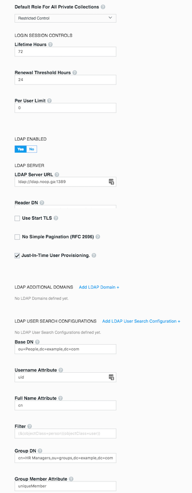

有关 LDAP 配置选项的详细信息，请阅读[与 LDAP 集成文档](https://docs.docker.com/datacenter/ucp/2.2/guides/configuration/integrate-with-ldap/)。

以下列表强调了设置 LDAP 身份验证时应考虑的重要配置选项：

* 在 LDAP 身份验证模式中，如果发现了帐户，要等到用户登录系统时才会在 UCP 中创建相应帐户。这是由 LDAP 配置中的**实时用户配置**设置控制的。建议打开此设置。
* 必须在目录服务器上配置一个用户帐户，才能从目录服务器发现和导入帐户。此用户帐户不必是权限非常高的帐户。实际上，它最好是一个可以查看必要的 organizationalUnit (`ou`) 并查询组成员资格的只读帐户。此帐户的详细信息是使用字段**读取帐户 DN** 和**读取帐户密码**来配置的。**读取帐户 DN** 必须使用专有名称格式。
* 尽可能使用安全 LDAP。
* 在切换到 LDAP 身份验证之前，使用 LDAP 配置的 **LDAP 测试登录**部分来确认您是否能连接。
* 在填写完表单并且测试连接成功之后，同步按钮会提供一个选项，可以立即运行同步，不必等待下次间隔。执行此同步就会启动 LDAP 连接，并运行过滤器来导入用户。
* 在完成并保存配置之后，应该可以使用符合同步条件的有效 LDAP/AD 帐户登录。系统支持的登录属性只有 `uid` 和 `sAMAccountName`。要在 Docker EE 中成功登录，帐户在 LDAP/AD 系统中应该处于正常状态。
* 可以通过在控制器上运行下列命令来查看和分析同步的进度/状态和出现的任何问题：``` docker logs ucp-controller ```

### 组织和团队

在 Docker EE 中存在的用户帐户，无论是通过 LDAP 同步还是手动受管，都可以组织为各种团队。团队需要包含在组织中。可以为创建的每个团队授予关于集合的角色，允许团队成员在关联的集合中进行操作。

要创建团队，需要先创建组织。可以在**用户管理** ―> **组织和团队** ―> **创建组织**中创建组织。

请思考此示例，它创建了一个名为 `enterprise-applications` 的组织：

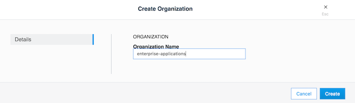

在 UCP UI 中，可以通过单击组织，然后单击**创建团队**来创建团队。也可以使用后文中描述的 eNZi API 实现同样的目的。可以将成员逐一添加到团队。如果使用 LDAP 身份验证模式，还可以用另一种方法向团队添加成员。这种方法的基础是从配置为启用 LDAP 身份验证模式的目录服务器自动同步发现的帐户。可以在此时应用更精细的过滤器来确定将发现的帐户归入哪些团队。一个团队可以有多个用户，而一个用户可以是零个到多个团队的成员。下面是一个示例，在 `enterprise-applications` 组织中创建两个团队：`Dev Team` 和 `Ops Team`。

首先创建组织：

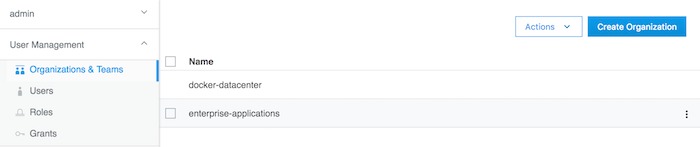

创建完组织后，就可以在其中创建 dev team：

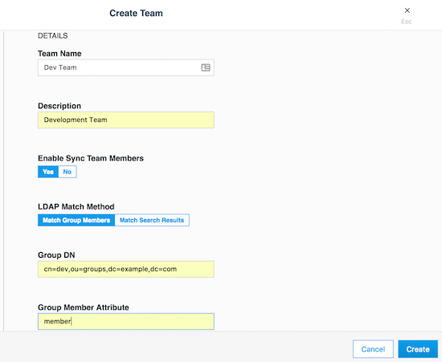

然后还可以创建 ops team：

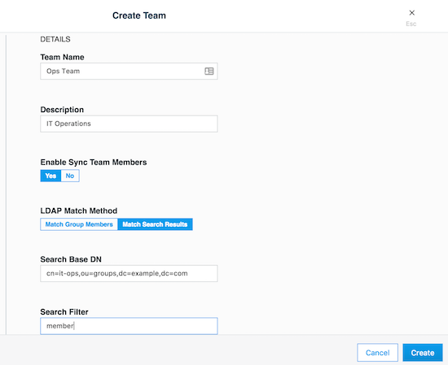

### 集合

集合是一种逻辑构造，可用于任意地聚集前文描述的一组资源。要创建集合，请使用位于**集合 ―> 创建集合**的表单。下面是一个示例，创建了一个名为 `production` 的集合。

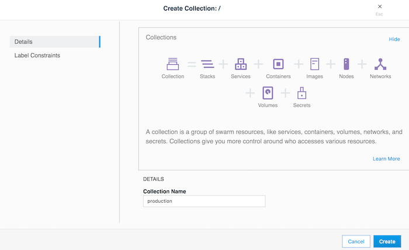

此示例中的 `production` 集合仅用于包含其他应用集合。有一个这样的集合是 `Billing Application`，可以通过单击**集合 ―> production ―> 查看子集 ―> 创建集合**在 `production` 集合中创建该集合，如下图所示。

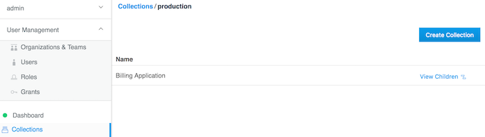

此时可以创建授权，依据团队在集合中的职能向其分配角色。

参考下面的具体示例会更方便理解：

> 假设您有一个简单的应用名叫 `www`，它是基于 `nginx` 官方镜像的 Web 服务器。再假设 `www` 应用是部署到生产中的收费应用之一。有三个团队需要访问此应用 ― `developers`、`testers` 和 `operations`。通常，`testers` 只需`仅查看`访问权即可，`operations` 团队为了管理和维护环境，需要`完全控制`。而 `developers` 团队需要对应用进行故障排除、重启和控制生命周期的访问权，但是应该禁止他们进行其他任何需要访问主机文件系统或启动特权容器的活动。这种特殊的访问权叫做`有限控制`。

### 授权

可以在 UCP 中的**用户管理** ―> **授权** ―> **创建授权**，使用向导创建授权。**Swarm** 集合是所有集合的根。单击**查看子集**可显示所有子集合。 `production` 集合应该是显示的集合之一。单击与 `production` 集合对应的**查看子集**来访问 `Billing Application` 集合。单击**选择集合**以选择它。屏幕应该类似于如下所示：

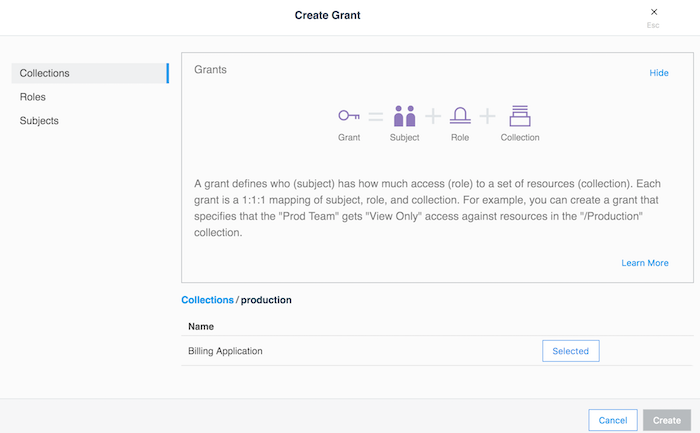

本节演示一个典型的应用场景，它使用“最低特权/权限”原则以及“责任分离”原则。它旨在满足上一节描述的示例应用 `www` 的访问需求。

还是在**创建授权**界面，单击**角色**。从下拉菜单选择**有限控制**角色。然后单击**使用者**。选择**组织**，然后从**组织**下拉菜单选择 `enterprise-applications`，从**团队**下拉菜单选择 `Dev Team`。单击**创建**。

重复同样的步骤以创建另一个授权，但是只选择 `production` 集合，并且选择角色`完全控制`，选择 `Ops Team` 作为使用者。

重复同样的步骤以创建另一个授权，但是只选择 `Billing Application` 集合，并且选择角色`仅查看`，选择 `Test Team` 作为使用者。

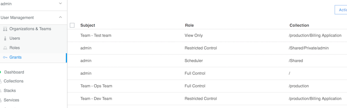

有了以上的授权设置，团队对于 `Billing Applications` 集合中的应用就有了基于其职能的相应访问级别。

要使 `www` 应用与 `Billing Applications` 集合关联，应以同样方式创建服务，但在按下图所示创建服务前要选择集合：

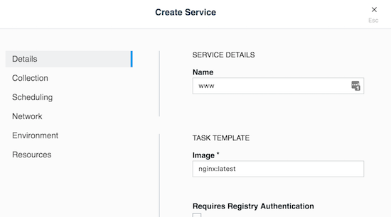

选择集合：

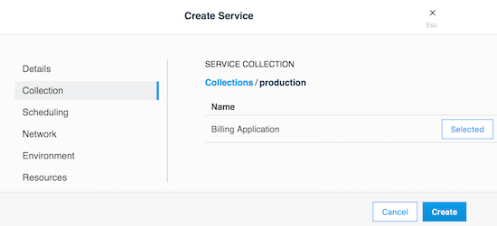

### 使用 LDAP 过滤器的策略

需要访问 UCP 的用户都是源于企业 Directory Server 系统的。这些用户是需要管理 Docker EE 基础架构的管理员用户，以及每个在 UCP 中配置的团队的全体成员。再假设需要访问 Docker EE 的整个用户群体（包括管理员、开发人员、测试人员和运维人员）是 Directory Server 中所有用户的一个子集。

在组织用户时建议使用的策略是创建一个总括的成员资格组，标识出所有 Docker EE 用户，不论他们属于哪个团队。姑且称这个组为 `Docker_Users`。不应该让任何用户直接成为这个组的成员。相反，应该让 `Docker_Users` 包含其他组，只有这些组才能作为它的成员。按照我们的示例，姑且就称这些组为 `dev`、`test` 和 `ops`。在我们的示例中，这些组是目录服务器中被称作*嵌套组*的结构的一部分。嵌套组允许权限从一个组继承至它的所有子组。

> **注：**有些目录服务器在默认情况下不支持嵌套组的功能，甚至也不支持 `memberOf` 属性。如果是这样，那就需要启用它们。如果选择的目录服务器完全不支持这些功能，那就应该用其他方法来组织用户和查询他们。Microsoft Active Directory 默认支持这两种功能。

在目录服务器中，应该将用户帐户作为这些子组的成员添加。这不应该影响组织单位的任何现有布局，也不应该影响这些用户的既有组成员资格。在定义团队时，应该将子组用作**组 DN** 的值。

最后，如果需要终止任何用户帐户的一切访问，只要将该帐户的组成员资格从 `Docker_Users` 这一个组删除，就会删除该用户的所有访问权。由于嵌套组的工作原理，在 Docker 中的所有其他访问权都会自动清除 ― 在下一次同步时，系统将会从所有团队成员资格中删除该用户帐户，不需要手动干预或执行其他步骤。在企业身份管理系统中，可以将这一步骤整合到标准的入职/离职自动化配置步骤中。

### 身份验证 API (eNZi)

AuthN API（在内部也叫 eNZi，发音是 N-Z）是一种用于 Docker EE 的集中式身份验证和授权服务及框架。此 API 完全集成和配置到 Docker EE 中，可以与 UCP 以及 DTR 无缝地协同工作。这是在后台工作的组件和服务，它通过标记、经由 OpenID Connect 的单点登录 (Web SSO) 以及帐户详细信息从基于 LDAP 的外部系统到 Docker EE 的同步，来管理帐户、团队和组织，用户会话、权限和访问控制。

用户和操作人员在进行普通的日常活动时，不需要关心 AuthN API 及其工作原理。但是，可以利用其功能使许多常用功能自动化和/或完全绕过 UCP UI 以直接管理和操纵数据。

在 [AuthN API](https://docs.docker.com/apidocs/v2.0.1/#!/accounts/func1) Docker 文档中记述了 RESTFul AuthN API 终端。

与 AuthN 的交互可以通过两种方式实现：经由暴露的 RESTful AuthN API 通过 HTTP 交互，或通过 `enzi` 命令交互。

例如，下面的命令使用 `curl` 和 `jq` 经由 AuthN API 通过 HTTP 获取 Docker EE 中的所有用户帐户：

    $ curl --silent --insecure --header "Authorization:Bearer $(curl --silent --insecure \
         --data '{"username":"<admin-username>","password":"<admin-password>"}' \
        https://<UCP-domain-name>/auth/login | jq --raw-output .auth_token)" \
        https://<UCP-domain-name>/enzi/v0/accounts | jq .

也可以在 UCP 控制器上用 CLI 调用 AuthN 服务。要连接该服务，请在 UCP 控制器上运行下列命令：

    $ docker exec -it ucp-auth-api sh

在得到的提示符 (`#`) 下面，输入 `enzi` 命令及子命令，例如下面示例中用于列出数据库表状态的命令：

    # enzi db-status

> **注：**请参阅[恢复 Docker EE 标准版和高级版的管理员密码](/article/Recovering_the_Admin_Password_for_Docker_EE_Standard_and_Advanced)获取详细示例。
