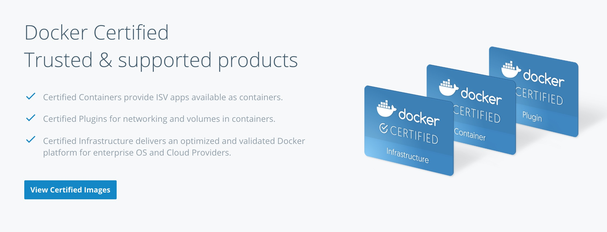
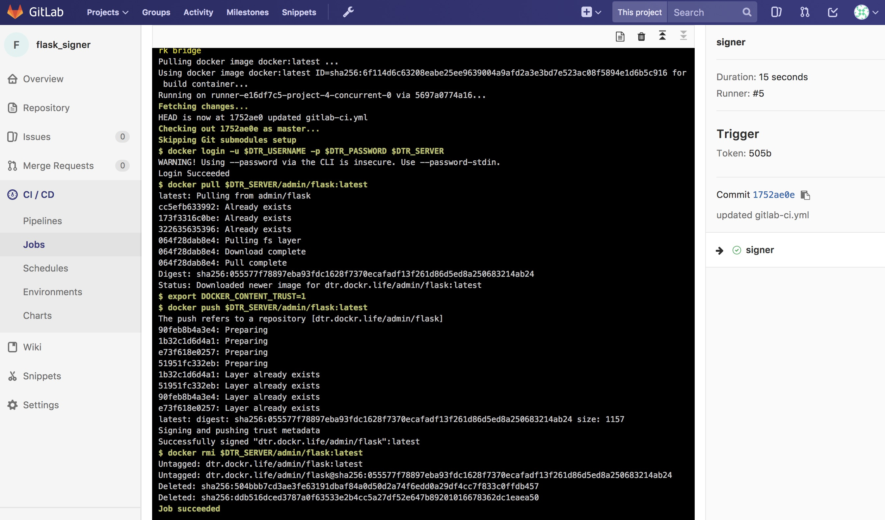
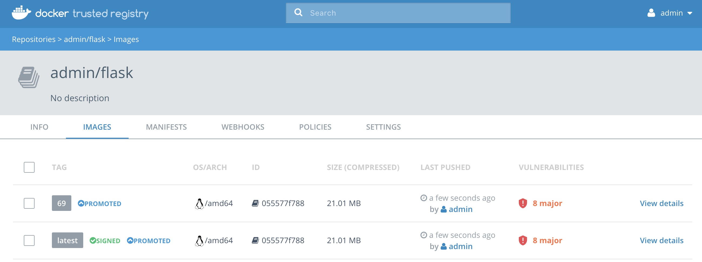

<a name="introduction"></a>
## 简介
创建安全的镜像供应链至关重要。每个组织都需要权衡所有可用选项并了解安全风险。可供选择的镜像过多大大增加了挑选难度。归根结底，每个组织都需要了解所有镜像的来源，即使它是来自于 [store.docker.com](http://store.docker.com) 中的可信认的上游镜像时也是如此。将镜像导入基础架构后，很有必要进行漏洞扫描。而带镜像扫描功能的 Docker Trusted Registry 提供了深入了解漏洞的能力。最后，整个过程需要实现自动化以提供简单的审核线索。

<a name="what-you-will-learn"></a>
## 学习内容
本参考架构介绍了安全供应链的组件。主题包括使用 Git、Jenkins 和 [Docker 商店](http://store.docker.com)来为供应链提供素材。可以使用同类工具替代本参考架构中列出的和用作示范的所有工具。安全供应链可分为三个阶段。

- 阶段 1 是代码镜像仓库。
- 阶段 2 是持续集成。
- 阶段 3 是可以扫描镜像的镜像库。

尽管存在许多替代工具，本文档主要关注一组工具组合：

- GitLab（阶段 1）
- Jenkins（阶段 2）
- Docker Trusted Registry（阶段 3）

对于此参考架构，需要牢记一条格言“任何人都不得将构建或部署直接投入生产的代码！”

<a name="prerequisites"></a>
## 先决条件
在继续之前,请先了解并熟悉：

- [Docker 文档中的 Docker 概念](https://docs.docker.com/engine/understanding-docker/)
- [保护 Docker EE 安全和安全最佳实践](https://success.docker.com/Architecture/Docker_Reference_Architecture%3A_Securing_Docker_EE_and_Security_Best_Practices)

<a name="abbreviations"></a>
## 缩写词
在本文档中使用了以下缩写词：

* UCP = Universal Control Plane
* DTR = Docker Trusted Registry
* DCT = Docker Content Trust
* EE = Docker 企业版
* RBAC = Role Based Access Controls（基于角色的访问控制）
* CA = Certificate Authority（认证中心）
* CI = Continuous Integration（持续集成）
* CD = Continuous Deployment（持续部署）
* HA = High Availability（高可用性）
* BOM = Bill of Materials（物料清单）
* CLI = Command Line Interface（命令行接口）

<a name="why"></a>
## 原因
您需要**安全供应链**的原因有多个。从理论上讲，必须为生产环境创建**安全供应链**。非生产环境管道也可因拥有自动化基础镜像而受益。提到供应链，就该想起一些重要的格言：

* “任何人都不得将构建或部署直接投入生产的代码！”
   * 它可以防止恶意代码偷偷进入通过审核的代码。它也有助于预防内部威胁。
* “一切都需要审核线索。”
   * 如果能够证明内容、时间、原因、和方式，就可以简化每个人的工作。
* “每个供应链都需要已知安全源头。”
   * 您会在沼泽中建房吗？

理想情况下，您希望用最快的速度获取镜像。您希望确保镜像的成功可以贯穿整个供应链。限制所要采取的步骤的数量是减少移动组件的理想方式。总体来看，只需要两个组件，_Git (GitLab) 和 Docker Trusted Registry (DTR)_。

下面是当今途径的基本图表。


<a name="begin"></a>
## 已知可靠源头
无论供应链有多出色，它都依赖于从“已知可靠源头”着手。阶段 1 可以分为两个可能的起点。

- 来自 [Docker 商店](https://store.docker.com)的自动化、预制、（最好）经认证的镜像
- 带有 Dockerfile 和其他 YAML 的私有安全 Git 镜像仓库

两者都有充分的理由。Docker 商店途径意味着继承上游镜像时面临少许风险，取决于供应商构建它的方式。Git 途径意味着构建镜像时需要冒风险。两个入口点都各有优缺点。两个起点都有可验证的内容，以确保它们是“已知可靠源头”。

在后面的部分将对两个源头进行详细介绍。

<a name="store"></a>
## Docker 商店
Docker 商店 [store.docker.com](https://store.docker.com)应当是查找镜像的首选位置。它为每个组织提供了巨大的优势。商店中包含大量随时可用的镜像。镜像所有者负责更新镜像并确保镜像无漏洞。Docker 商店保证了所有“认证”和“官方”镜像都经过漏洞扫描。对于“认证”镜像，Docker 商店和供应商还会采取更进一步的措施。认证镜像需要经历[全面的审查流程](https://success.docker.com/Store)。从根本上说，供应商和 Docker 为认证镜像提供容器可正常工作的保证。商店中还包含“官方”镜像。“官方”镜像由 Docker 构建，并且也会由 Docker 定期进行更新。Docker 商店和 [Docker Hub](https://hub.docker.com) 中还包含社区镜像。非万不得已请勿使用社区镜像。


<a name="upstream"></a>
### 挑选合适的上游镜像
从[商店](https://store.docker.com)中挑选合适的镜像至关重要。决定使用哪个镜像的决策过程非常简单。请优先考虑[认证镜像](https://blog.docker.com/2017/03/announcing-docker-certified/)，然后再考虑官方镜像。最后考虑社区镜像。请仅使用“自动构建”的社区镜像。这有助于确保它们会被及时更新。验证镜像的新鲜度也很重要。

以下内容节选自有关[认证镜像](https://blog.docker.com/2017/03/announcing-docker-certified/)的一篇博文：

*Docker 认证计划旨在帮助技术合作伙伴和企业客户识别在质量、合作支持及合规性方面表现超群的容器和插件。Docker 认证以可用的 Docker EE 基础架构为标准，借助 Docker 和发布者的支持，为企业提供在容器中运行更多技术的可靠途径。借助显而易见的徽章，客户可以快速识别出经认证的容器和插件，并且可以确信它们采用最佳实践构建，经测试可在 Docker EE 上平稳运行。*



在 [Docker 商店](https://store.docker.com)中搜索镜像时，请务必选中** Docker 认证**复选框。


 [Docker 商店](https://store.docker.com)的一个出色功能是镜像都需要经过安全漏洞扫描。此功能使您可在拉取镜像前先对镜像进行检查。


除了[商店](https://store.docker.com)中的“认证”镜像之外，另一种很棒的资源是 Hub 的[“官方”镜像](https://hub.docker.com/explore/)。所有这些“官方”镜像都是自动化的，经过扫描且更新频率很高。

当使用非官方或未经认证的上游镜像时，需要确保镜像为自动构建。一个重要的步骤是审查 Dockerfile，以确保镜像中仅包含正确的数位。万不得已时，可考虑创建社区的“自动”镜像。

请注意，任何从 Hub 或商店中拉取的镜像也都应通过 Docker Trusted Registry 接受相同级别的详细审查。

<a name="gitlab"></a>
## Git - (GitLab CE)
在现代企业中，版本控制系统对于所有代码都很重要。Git 等版本控制系统也是跟踪配置的出色方式。Git 真正成为了企业的“数据源”。多家公司都搭建了 Git 服务器。[GitLab CE](https://store.docker.com/images/gitlab-community-edition) 是出色的开源 Git 服务器。在下面的示例中使用的是 GitLab 社区版。

理想的 Git 镜像仓库结构包含构建和部署所需的所有文件。具体来说，就是 `Dockerfile`、代码和 `stack.yml`。 `Dockerfile` 是用来构建 Docker 镜像的“食谱”。代码文件应该简单易懂。 `stack.yml` 用来描述应用栈。 `stack.yml` 也被称为 compose YAML 文件。下面的示例使用 Docker 设置了一个 GitLab 实例。该实例应位于您的 Docker 企业版集群外部。

<a name="gitlab_setup"></a>
### 设置
针对[使用 Docker 镜像设置](https://docs.gitlab.com/omnibus/docker/)，GitLab 提供了一些非常好的说明。Git 默认使用 SSH 端口 (22)，因此无需更改主机或 Git 的端口。下面展示了如何将 GitLab 的端口移动到 2022。对于生产环境来说，移动主机的 SSH 端口可能更为合理。另外，对于有状态安装，需要使用永久存储。使用应用栈文件来简化安装过程：

```
version: "3.3"
services:
  gitlab:
    image: gitlab/gitlab-ce:latest
    ports:
      - 80:80
      - 443:443
      - 2022:22
    volumes:
      - /var/run/docker.sock:/var/run/docker.sock
      - /srv/gitlab/config:/etc/gitlab
      - /srv/gitlab/logs:/var/log/gitlab
      - /srv/gitlab/data:/var/opt/gitlab
    restart: always
    networks:
      gitlab:

  gitlab-runner:
    image: gitlab/gitlab-runner:alpine
    volumes:
      - /var/run/docker.sock:/var/run/docker.sock
      - /srv/gitlab-runner/config:/etc/gitlab-runner
      - /root/.docker:/root/.docker
      - /root/.notary:/root/.notary
    restart: always
    networks:
      gitlab:

networks:
  gitlab:
```

将以上内容保存为 `gitlab.yml`。然后执行以下命令：

```
$ sudo docker swarm init
$ sudo docker stack deploy -c gitlab.yml gitlab
```

注意，GitLab 需要一分钟来启动。

下一部分将介绍镜像仓库内容。

<a name="repo_contents"></a>
### 镜像仓库内容
利用“数据源”的一个好方法是将构成镜像的所有内容与应用栈存储在一起。该示例为三层应用，由“Web”、“middleware”和“db”组成。将所有三个 Dockerfile 和 `stack.yml` 存储在相同的位置非常便于所有团队进行构建和部署。理论上，目录结构中应包含：

1. 名称为 `web.dockerfile`、`middleware.dockerfile` 和 `db.dockerfile` 的 Dockerfile。
2. 每层的源数位和工件（位于另一个目录中）。
3.  `stack.yml`（用于 `docker stack deploy`）。
4. GitLab CI 描述 `.gitlab-ci.yml`（后面将介绍）。

别忘了在 Dockerfile 中使用多阶段构建。多阶段构建有助于大幅减小生成的镜像的大小。现在，您可以自动实现这一切。


<a name="gitlab_ci"></a>
## 持续集成自动化
为了践行“任何人都不得将代码推送到生产环境”的理念，您需要将这一切自动化。借助较新版本的 GitLab，可以直接配置 CI/CD 功能。无需再使用其他工具。这大大简化了设置过程和可维护性。要利用 CI/CD，首先请至少注册一个运行程序。运行程序包含在前一创建部分中的 `gitlab.yml` 中。下一步是配置运行程序。

<a name="gitlab_config"></a>
### 配置运行程序
与其他 CI 工具相似，GitLab 也要求使用运行程序来完成构建。要激活在前一部分中随 `docker stack deploy` 一起安装的运行程序，需要获取运行程序令牌。浏览至**管理区域** --> **运行程序**。在此处您将找到注册运行程序所需的令牌。


值得庆幸的是，存在注册运行程序的捷径。即通过 ssh 访问 GitLab 节点并运行以下 Docker 命令（从 GitLab CE 页面通知令牌）：

```
docker exec -it $(docker ps --format '{{.Names}}\t{{.ID}}'|grep runner|awk '{print $2}') gitlab-runner \
register -n \
--url http://gitlab.example.com \
--registration-token <^>$token<^^> \
--executor docker \
--description "local docker" \
--docker-image "docker:latest" \
--docker-volumes "/var/run/docker.sock:/var/run/docker.sock" \
--docker-volumes "/root/.docker:/root/.docker"
```

注册完成后，您将看到运行程序显示`已共享`标签。您还需要确保选中了`运行无标签作业`，未选中`锁定到当前项目`。

<a name="gitlab-yml"></a>
### 构建描述
CI 将在此处发挥作用。GitLab 依赖镜像仓库根目录中名称为 `.gitlab-ci.yml` 的文件。该文件就是 CI 描述文件。

> **注：**有关此主题，请查看 [GitLab 文档](https://docs.gitlab.com/ee/ci/yaml/README.html)。

请思考以下情况。请务必在各个镜像仓库中配置变量。

下面是从 git 本身构建镜像的良好示例。

```
# Official docker image.
variables:
  DOCKER_DRIVER: overlay2

image: docker:latest

before_script:
  - docker login -u <^>$DTR_USERNAME<^^> -p <^>$DTR_PASSWORD<^^> <^>$DTR_SERVER<^^>

build:
  stage: build
  script:
    - docker build --pull -t dtr.example.com/admin/"<^>$CI_PROJECT_NAME<^^>"_build:<^>$CI_JOB_ID<^^> .
    - docker push dtr.example.com/admin/"<^>$CI_PROJECT_NAME<^^>"_build:<^>$CI_JOB_ID<^^>
    - docker rmi dtr.example.com/admin/"<^>$CI_PROJECT_NAME<^^>"_build:<^>$CI_JOB_ID<^^>
```

下面是用于拉取、添加标签以及将镜像从 store.docker.com 推送到 DTR 的 `.gitlab-ci.yml` 的良好示例。

```
# Official docker image.
variables:
  DOCKER_DRIVER: overlay2

image: docker:latest

before_script:
  - docker login -u <^>$DTR_USERNAME<^^> -p <^>$DTR_PASSWORD<^^> <^>$DTR_SERVER<^^>

stages:
  - signer

signer:
  stage: signer
  script:
    - docker pull <^>$DTR_SERVER<^^>/admin/flask:latest
    - export DOCKER_CONTENT_TRUST=1
    - docker push <^>$DTR_SERVER<^^>/admin/flask:latest
    - docker rmi <^>$DTR_SERVER<^^>/admin/flask:latest
```


现在，已为 GitLab 设置好变量和构建描述。接下来，为项目添加触发器。

<a name="gitlab-triggers"></a>
### 管道触发器
GitLab 现在包含出色的 CI 工具以及远程触发管道的方法。GitLab 会调用这些触发器。创建这些触发器最简便的方法是浏览至**项目** --> **设置** --> **CI/CD** --> **管道触发器** --> **展开**。


此处为触发器格式的示例。`http://gitlab.example.com/api/v4/projects/<^><PROJECT><^^>/trigger/pipeline?token=<^><TOKEN><^^>&ref=<^><REF><^^>`.此处所需的三个字段为 `<^><PROJECT><^^>`、`<^><TOKEN><^^>` 和 `<^><REF><^^>`。`<^><REF><^^>` 应设置为分支名称。`<^><TOKEN><^^>` 应设置为您从 GitLab 获取的令牌。获取 `<^><PROJECT><^^>` 的最佳方法是复制**管道触发器**页面中的 URL。您将在稍后用到管道触发器。

接下来，添加 Docker Trusted Registry。

<a name="dtr"></a>
## Docker Trusted Registry
Docker Trusted Registry 不仅仅是简单的镜像库。DTR 现在包含一些可强化供应链的出色功能。新功能包括镜像提升和不可变性等。

在接下来的部分中将介绍部分新功能。

<a name="dtr-scan"></a>
### 镜像扫描
从 版本 2.2.0 开始，DTR 包含本地镜像扫描功能。DTR 中的本地扫描引擎将对照 [CVE 数据库](https://cve.mitre.org/)扫描镜像。首先，扫描程序将对镜像的每一层执行二进制扫描，识别每一层中的软件组件，并对每个组件的 SHA 编制索引。该二进制扫描会逐个数位地对组件进行评估，因此存在漏洞的组件总会被发现，无论它们的文件名为何，无论它们是否包含在分发清单或软件包管理器中，无论它们是静态链接的组件还是动态链接的组件，即使它们来自基础镜像 OS 分发也不例外。

然后该扫描会将每个组件的 SHA 与 CVE 数据库（已知信息安全漏洞的“字典”）进行比较。当 CVE 数据库更新时，扫描服务会审查已编制索引的组件以发现与新发现的漏洞匹配的组件。大多数扫描会在几分钟之内完成，但是较大的镜像仓库可能需要较长的时间才能扫描完，具体取决于系统资源。扫描引擎提供了扫描所有镜像的中心点并提供物料清单 (BOM)，可将其与 [Notary](#dtr-notary) 耦合以确保为镜像提供极其安全的供应链。

从 DTR 2.3.0 开始，该扫描引擎也可以扫描 Windows 二进制文件。


<a name="dtr-scan-setup"></a>
#### 设置镜像扫描
开始之前，请确保您或您的组织已经购买了包含 Docker 安全扫描功能的 DTR 许可证，并且您的 Docker ID 可以在 Docker 商店中访问和下载此许可证。

默认情况下，当启用安全扫描时，每次执行 `docker push`，新镜像仓库都会自动执行扫描，但是，默认情况下，任何在启用扫描前就已存在的镜像仓库都会被设为“手动扫描”模式。如果这些镜像仓库仍在使用，则可以在每个镜像仓库的**设置**页面中更改此设置。

要启用镜像扫描，转至**设置 --> 安全**，选择**启用扫描**，然后选择使用 Doker 提供的 CVE 数据库（**联机** ― 默认选项）还是使用本地上传文件（**脱机** ― 仅对未联网的环境或无法连接到 Doker 进行持续更新的环境推荐该选项）。

以联机模式启用后，DTR 将从 Docker 下载 CVE 数据库，首次同步可能会花费较长时间。如果您的安装无法访问 `https://dss-cve-updates.docker.com/`，您必须手动上传包含安全数据库的 `.tar` 文件。

* 如果您使用的是**在线**模式，DTR 实例就会连接 Docker 服务器，下载最新的漏洞数据库，然后进行安装。安装完成后会立即开始扫描。
* 如果您使用的是**脱机**模式，则按照**更新扫描数据库 - 脱机模式**中的说明上传初始安全数据库。


<a name="dtr-scan-offline"></a>
#### CVE 脱机数据库
如果 DTR 实例无法连接更新服务器，可以下载并安装包含数据库更新的 `.tar` 文件。可从 [Store.docker.com](https://store.docker.com) 中**我的内容** --> 许可证**设置**下找到这些脱机 CVE 数据库文件。


<a name="dtr-scan-results"></a>
#### 扫描结果
要查看扫描的结果，浏览至镜像仓库本身，然后单击**镜像**。未发现漏洞的镜像扫描会显示绿色的勾号盾牌图标：


发现漏洞的镜像扫描会显示红色的警告盾牌：


对于扫描结果，存在两种视图，**层**和**组件**。**层**视图显示镜像的哪个层上具有存在漏洞的二进制文件。要诊断漏洞位于 Dockerfile 何处时，此视图极其有用。


单击层本身时，将显示存在漏洞的二进制文件，以及该层上的所有其他内容。在本示例中，存在几个可能存在漏洞的二进制文件：


单击存在漏洞的镜像来查看 **组件** 视图。从**组件**视图中，可查看 CVE 编号、指向 CVE 数据库的链接、文件路径、受影响的层、严重性和严重性说明：


现在您可以对存在漏洞的二进制文件/层/镜像采取操作。

如果发现了存在漏洞的组件，请检查是否存在安全漏洞已经修复的更新后版本。如有必要，请联系组件的维护人员来确保在未来的版本或补丁更新中修复此漏洞。

如果该漏洞位于`基础层`（例如操作系统）中，您可能无法纠正镜像中的问题。在这种情况下，您可能需要切换到另一个基础层版本，或者可以寻找一个功能相当但不太容易受到攻击的基础层。您也可以确定是否可以接受该漏洞或暴露。

通过使用存在漏洞的组件的已更新和已更正版本，或使用功能相同的不同组件，来解决镜像仓库中的漏洞问题。当您已更新源代码时，请运行一个构建以创建新镜像，标记镜像并将更新后的镜像推送到您的 DTR 实例。然后，您可以重新扫描该镜像以确认您已修复这些漏洞。

当有新漏洞发布时应该怎么办？实际上有两个阶段。第一阶段是为镜像的二进制文件和层生成哈希值指纹。第二阶段是将这些哈希值与 CVE 数据库进行比较。生成指纹阶段耗时最久。比较哈希值很快就可以完成。当有新的 CVE 数据库时，DTR 只需将现有哈希值与新的数据库进行比较即可。此过程耗时也较短。扫描结果会一直更新。

现在已经有了扫描结果，接下来该添加提升策略了。

<a name="dtr-promotion"></a>
### 镜像提升策略
Docker Trusted Registry 2.3.0 发行版中添加了新的提升镜像的方法。您可以基于漏洞的阈值、标签匹配、软件包名称乃至许可证创建提升策略。它在自动化镜像流中发挥巨大作用。它也可以确保与策略不匹配的镜像无法进入生产环境。条件如下：

* 标签名称
* 软件包名称
* 所有漏洞
* 关键漏洞
* 重大漏洞
* 微小漏洞
* 所有许可证


您可创建策略并从源或目标进行查看。下面是**所有漏洞**的示例。它设置了在有零个漏洞时将 `admin/flask_build` 镜像仓库“提升”到 `admin/flask` 的提升策略。

首先，浏览至源镜像仓库，然后转至**策略**选项卡。从该选项卡中，选择**新提升策略**。在左侧，选择**所有漏洞**。然后单击**小于或等于**，在文本框中输入 `0`（零），并单击**添加**。现在，为此提升策略选择目标。在右侧，选择要作为目标的命名空间和镜像。单击**保存并应用**。应用要对源镜像仓库执行的策略。**保存**会将策略应用到未来的推送。

请留意**目标中的标签名称**。此选项提供根据部分变量更改标签的能力。建议您开始时不要更改标签名称。有关更多信息，请查看[镜像提升策略文档](https://docs.docker.com/datacenter/dtr/2.3/guides/user/create-promotion-policies/)。


请留意**已提升**徽章。需要注意的一点是 Notary 签名不随镜像一起提升。这意味着 CI 系统必须对已提升的镜像进行签名。这可通过使用 webhook 和提升策略来完成。


考虑基础镜像从 Jenkins 推送到 DTR 时的 DTR 设置。如果镜像有零个漏洞 ― 良好的**安全供应链**的一部分，那么将扫描并提升它们。这就要说到镜像不可变性了。

<a name="dtr-immutability"></a>
### 镜像不可变性
DTR 2.3.0 和更高版本具有将镜像仓库设置为**不可变更**的选项。将镜像仓库设置为**不可变更**意味着标签将无法被覆盖。这是一个很好的功能，可保证基础镜像不会随着时间的推移更改。本示例为 Alpine 基础镜像。理想情况下，CI 将更新基础镜像并将其推送到 DTR（带有特定标签）。具有**不可变性**可保证无论何时查看特定标签，它都不会更改。可使用镜像提升策略来对此功能进行扩展。


<a name="dtr-immutability_policy"></a>
### 镜像不可变性 + 提升策略
对不可变更的标签使用提升策略的一个很好的示例是直接从 Git 构建镜像。本示例使用了简单的 flask 应用。`.gitlab-ci.yml` 具有三个基本步骤：构建、推送、删除。将启用了不可变性的 DTR 镜像仓库 `dtr.example.com/admin/flask_build`推送到私有镜像仓库。


GitLab 推送时使用构建号作为标签。格式类似于：`dtr.example.com/admin/flask_build:66`.由于启用了不可变性，无法覆盖标签 `66`。这将奠定牢固的基础。接下来，基于相同的阈值添加两个提升策略。第一个策略将镜像提升到公有镜像仓库 `dtr.example.com/admin/flask`，标签不变。第二个策略使用`最新的`标签进行提升。


结果是将镜像“提升”了两次。一次使用相同的标签，另一次使用`最新的`标签。


供应链中的下一个环节是 webhook。

<a name="dtr-webhook"></a>
### Webhook
从 DTR 2.3.0 开始，可通过 GUI 管理 webhook。DTR 包含用于推送新标签或删除镜像等常见事件的 webhook。这使您可以从自己的 DTR 集群构建复杂的 CI 和 CD 管道。
您可订阅的 webhook 事件如下（特定于镜像仓库）：

* 标签推送
* 标签删除
* 清单推送
* 清单删除
* 安全扫描已完成
* 安全扫描失败
* 从镜像仓库提升的镜像

Webhook 是按镜像仓库创建的。可在 [Docker 文档](https://docs.docker.com/datacenter/dtr/2.3/guides/user/create-and-manage-webhooks/)中找到有关 webhook 的更多信息。DTR 也可以呈现 API，方法是浏览至右上方登录下面的菜单，然后选择 **API 文档**。

本示例是使用 `dtr.example.com/admin/flask_build` 镜像仓库的前一个示例的后续部分。现在，添加 webhook。要使用“从镜像仓库提升的镜像”事件添加，必须将 webhook 配置为可通知 GitLab 使用 Notary 以及对镜像进行签名。


为了提供参考，我们使用的 `WEBHOOK URL` 是`http://gitlab.example.com/api/v4/projects/<^><PROJECT><^^>/trigger/pipeline?token=<^><TOKEN><^^>&ref=<^><REF><^^>`。此处所需的三个字段为 <^><PROJECT><^^>、<^><TOKEN><^^> 和 <^><REF><^^>。<^><REF><^^> 应设置为分支名称。<^><TOKEN><^^> 应设置为您从 GitLab 获取的令牌。<^><PROJECT><^^> 可从触发器创建页面获取。可在[触发器]（#gitlab-触发器）部分找到有关触发器的更多详细信息。webhook 和触发器的优势是它们可以启动新作业，与镜像签名相似。

<a name="dtr-notary"></a>
### Content Trust/镜像签名 ― Notary

*Notary 是可用来发布和管理可信的内容集合的工具。发布者可对集合进行数字签名，使用者可以验证内容的完整性和来源。此功能基于简单的密钥管理和签名界面构建，可创建经过签名的集合及配置受信任的发布者。*

Docker Content Trust/Notary 为每个镜像提供了加密签名。签名提供了安全性，因此您获取的正是您期望的镜像。如果您对保护 Notary 安全的方式感兴趣，请参阅 [Notary 的架构](https://docs.docker.com/notary/service_architecture/)。由于 Docker EE 在“默认情况下是安全的”，Docker Trusted Registry 随附开箱即用的 Notary 服务器。

成功签名的镜像在 DTR GUI 中具有绿色的勾号标志。


<a name="gitlab_sign"></a>
##### 使用 GitLab 签名
随着团队不断壮大，管理所有开发者密钥也变得越来越困难。可用来减轻管理负荷的方法之一是禁止开发者对镜像进行签名。使用 GitLab 来对即将用于生产环境的所有镜像进行签名可省去大部分密钥管理工作。但仍需要对 GitLab 服务器上的密钥进行保护和备份。

第一步是为您的 CI 系统创建用户帐户。例如，假设您使用的 CI 系统是 GitLab。浏览至 DTR 的 Web 界面。以管理员用户身份浏览至**组织**，然后选择**新组织**。将新组织命名为 `ci`。现在，添加 Jenkins 用户，方法是浏览至“组织”并选择**添加用户**。创建名为 `gitlab` 的用户并设置强密码。此操作将创建用户并将其添加到 `ci` 组织。接下来，向 GitLab 用户授予`组织管理员`身份，以使用户可以管理 `ci` 组织下的镜像仓库。再接下来，浏览至 UCP 的**用户管理**。在 `ci` 组织下创建名为 `gitlab` 的团队。


现在团队就设置好了，需要启用策略实施。浏览至**管理员设置**，然后选择 **Docker Content Trust** 部分。选中**仅运行已签署的镜像**复选框以启用 Docker Content Trust。在出现的选择框中，选择刚才创建的 `ci` 团队。保存设置。

此策略要求 `docker pull`、`docker run` 或 `docker service create` 中引用的每个镜像均由与该 `gitlab` 团队的成员对应的密钥签名。在此示例中，唯一的成员是用户 `gitlab`。


签名策略实施使用用户客户端证书包中颁发的证书将签名与用户相关联。使用无痕浏览器窗口（或以其他方式）登录您先前创建的用户帐户 `gitlab`。为此用户下载一个客户端证书包。此外，还建议您更改与 UCP 中存储的公钥相关联的说明，以便您将来能够识别用于签名的是哪个密钥。

请注意，每次用户检索新的客户端证书包时，均会生成一个新的密钥对。因此，有必要对用户选择指定为其签名证书包的特定证书包进行跟踪。

解压缩客户端证书包后，只需要将两个文件用于签名，`cert.pem` 和 `key.pem`。它们分别代表了用户的签名身份的公用和私有部分。将 `key.pem` 文件加载到 Jenkins 服务器，并使用 `cert.pem` 在 Trusted Collection 中为用户 `gitlab` 创建委派。

在 GitLab 服务器上，填充本地 `/root/.docker/` 目录，然后初始化该 notary 镜像仓库。在 `gitlab` 服务器上，执行以下操作：

```
#become root
sudo -i

#change to the /root directory
cd /root

#make directory for CA
mkdir -p /root/.docker/tls/dtr.example.com/

#copy CA to the notary/docker location
curl -sk https://dtr.example.com/ca -o /root/.docker/tls/dtr.example.com/ca.crt

#get the notary client
wget https://github.com/docker/notary/releases/download/v0.4.3/notary-Linux-amd64

#chmod it
chmod 755 notary

#setup alias
alias notary="notary -s https://dtr.example.com --tlscacert /root/.docker/tls/dtr.example.com/ca.crt -d ~/.docker/trust"

#check notary
./notary key list

#init the repository.Make all the passwords the same to simplify things.
notary init -p dtr.example.com/admin/flask

# rotate snapshot key
notary key rotate dtr.example.com/admin/flask -r snapshot

# setup releases role
notary delegation add dtr.example.com/admin/flask targets/releases cert.pem --all-paths

# setup user role
notary delegation add dtr.example.com/admin/flask targets/gitlab cert.pem --all-paths

# publish changes
notary publish dtr.example.com/admin/flask
```

要启用自动签名，需要在 GitLab 项目中配置与“构建描述”变量相似的 `DOCKER_CONTENT_TRUST_REPOSITORY_PASSPHRASE` 变量。接下来，创建用于签名的 GitLab 项目。使用下面的 `.gitlab-ci.yml` 创建新项目。此项目使用本地 `/root/.docker/trust` 目录。

```
# Official docker image.
variables:
  DOCKER_DRIVER: overlay2

image: docker:latest

before_script:
  - docker login -u <^>$DTR_USERNAME<^^> -p <^>$DTR_PASSWORD<^^> <^>$DTR_SERVER<^^>

stages:
  - signer

signer:
  stage: signer
  script:
    - docker pull <^>$DTR_SERVER<^^>/admin/flask:latest
    - export DOCKER_CONTENT_TRUST=1
    - docker push <^>$DTR_SERVER<^^>/admin/flask:latest
    - docker rmi <^>$DTR_SERVER<^^>/admin/flask:latest
```

签名项目的成功输出应类似于下面的截图：



现在，最后的几个步骤是为镜像签名项目创建管道触发器。使用带有“从镜像仓库提升的镜像”事件的 webhook。


<a name="conclusion"></a>
## 总结
实现自动化的 **安全供应链** 并没有那么困难。遵循本参考架构就可设置带有至少两个项目的 GitLab。一个项目针对代码、Dockerfile 和应用栈 yaml。另一个项目针对镜像签名组件。DTR 也具有两个镜像仓库。一个针对私有构建，另一个针对经过签名的已提升的镜像。

主要目标是构建一个**已提升的**（基于全面扫描）和**经过签名的**镜像（带有 Notary）（通过**自动**方式）。



虽然介绍了特定的工具，但是本参考架构有几个关键点：

* 自动化一切
* 挑选已知可靠源头
* 利用镜像扫描和提升
* 对镜像进行签名
* 任何人都不得将构建或部署直接投入生产的代码！

下面是工作流回顾。


仔细分析一下这些观念，可以使用组织拥有的工具来替换个别工具。
