## 简介

服务发现对服务进行注册并发布其连接信息，以使其他服务了解如何连接到服务。随着应用向微服务和面向服务的架构转变，服务发现已经成为所有分布式系统的必要组成部分，增加了这些环境的运维复杂性。

Docker 企业版 (Docker EE) 包含服务发现和负载均衡功能，可为整个组织的开发运维计划提供助力。服务发现和负载均衡可以方便开发人员创建可动态互相发现的应用。另外，这些功能还简化了运维工程师扩展应用的过程。

Docker 使用称作**服务**的概念来部署应用。服务由基于相同的镜像创建的容器组成。每个服务都由在工作节点上执行并且会定义应用的状态的任务组成。部署服务时，服务定义在创建服务时完成。服务定义包含很多信息，其中包括，服务包含的容器、发布的端口、连接的网络和从节点的数量。所有这些任务共同组成服务的理想状态。如果某个节点未通过运行状况检查或服务定义中某个特定的服务任务未通过运行状况检查，那么集群将调整服务状态，使其与另一个运行状况良好的节点的服务状态一致。Docker EE 包含服务发现、负载均衡、扩展和调整事件，以使该编排可以无缝工作。

## 学习内容

此参考架构涵盖 Docker EE 提供的服务发现和负载均衡领域的解决方案。创建服务时，Docker 使用 DNS 实现服务发现，而且 Docker 内置了不同的网格路由，可确保应用高度可用。UCP 2.0 发行版引入了新的应用层网格路由，称为 **HTTP 网格路由 (HRM)**，它基于 DNS 主机名路由 HTTP 流量。阅读完本文档之后，您将充分了解 HRM 的工作原理以及它如何与其他 Docker 服务发现和负载均衡功能集成。

## 使用 DNS 的服务发现

Docker 使用嵌入的 DNS 来为在单个 Docker 引擎上运行的容器和在 Docker Swarm 中运行的`任务`提供服务发现功能。Docker 引擎具备内部 DNS 服务器，可为用户定义的 bridge、overlay 和 MACVLAN 网络中的主机上的所有容器提供名称解析。每个 Docker 容器（或`任务`（swarm mode 中））都具备一个可将 DNS 查询转发到 Docker 引擎的 DNS 解析器，它充当 DNS 服务器。然后，Docker 引擎将在发送请求的容器所属的每个网络上检查 DNS 查询是否属于容器或`服务`。如果属于，Docker 引擎将在其键值存储中查找与容器、`任务`、或`服务`的**名称**匹配的 IP 地址，并将 IP 或`服务`虚拟 IP (VIP) 返回给请求方。

服务发现*将网络作为范围*，这意味着只有在相同网络上的容器或任务才可使用嵌入的 DNS 功能。不在相同网络上的容器无法解析彼此的地址。而且，只有在特定网络上具备容器或任务的节点才会存储该网络的 DNS 条目。这有助于提高安全性和性能。

如果目标容器或`服务`和源容器位于不同的网络上，Docker 引擎会将 DNS 查询转发到默认 DNS 服务器。

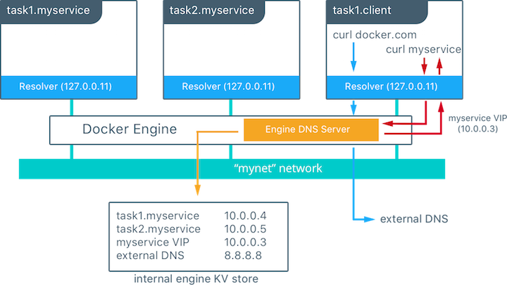

本示例中，有一个具有两个容器的服务，称为 `myservice`。在相同的网络上还存在第二个服务 (`client`)。`client` 运行两个 `curl` 操作（为 `docker.com` 和 `myservice`）。以下为因此发生的操作：

* `client` 为 `docker.com` 和 `myservice`发起 DNS 查询。
* 容器的内置解析器在 `127.0.0.11:53` 上拦截 DNS 查询，并将其发送到 Docker 引擎的 DNS 服务器。
* `myservice` 解析到服务的虚拟 IP (VIP)，并在内部均衡分配到各个任务 IP 地址。容器名也将被解析，只不过是直接解析到其 IP 地址。
* `docker.com` 没有作为服务名称存在于 `mynet` 网络中，所以请求被转发给已配置的默认 DNS 服务器。

## 内部负载均衡

当在 Docker Swarm 集群中创建服务时，将自动向其分配虚拟 IP (VIP)，它是服务的网络的一部分。解析服务的名称时将返回 VIP。流向 VIP 的流量将被自动发送到整个 overlay 网络上该服务的所有运行状况良好的任务。此方法可避免由于在客户端进行任何负载均衡，因为仅有一个 IP 返回到客户端。Docker 会处理所有路由并将流量平均分发给运行状况良好的服务任务。

要获取服务的 VIP，请按以下方式运行 `docker service inspect myservice` 命令：

    # Create an overlay network called mynet
    $ docker network create -d overlay mynet
    a59umzkdj2r0ua7x8jxd84dhr

    # Create myservice with 2 replicas as part of that network
    $ docker service create --network mynet --name myservice --replicas 2 busybox ping localhost
    8t5r8cr0f0h6k2c3k7ih4l6f5

    # Get the VIP that was created for that service
    $ docker service inspect myservice
    ...

    “VirtualIPs":[
                    {
                        "NetworkID":"a59umzkdj2r0ua7x8jxd84dhr",
                        "Addr":“10.0.0.3/24"
                    },
    ]

> DNS 轮询 (DNS RR) 负载均衡是适用于服务（使用 `--endpoint-mode`配置）的另外一个负载均衡选项。在 DNS RR 模式下，不为每个服务单独创建 VIP。Docker DNS 服务器通过轮询方式将服务名称解析到各个容器 IP。

## 外部负载均衡（Swarm Mode 网格路由）

创建或更新服务时，您可以使用 `--publish` 标志在外部公开服务。在 Docker swarm mode 下公开端口意味着集群中的每个节点都将侦听端口。但是，如果服务的任务不在侦听该端口的节点上应该怎么办呢？

在这种情况下需要使用网格路由。网格路由是 Docker 引擎 1.12 中的一项新功能，它将 `ipvs` 和 `iptables` 相结合以创建功能强大的全集群传输层 (L4) 负载均衡器。它允许所有 swarm 节点接受服务发布的端口上的连接。任何 swarm 节点收到发往运行中`服务`的已发布 TCP/UDP 端口的流量时，它会使用称为`入口`的预定义 overlay 网络将流量转发到服务的 VIP。`入口`网络的行为方式与其他 overlay 网络相似，但是其唯一的目标是将网格路由流量从外部客户端传输给集群服务。它使用与前一部分中所述相同的基于 VIP 的内部负载均衡功能。

启动服务后，您就可以为应用创建外部 DNS 记录，并将其映射到任何或所有 Docker swarm 节点。您无需担心容器在哪里运行，因为有了网格路由路由功能，集群中的所有节点就像一个整体。

    #Create a service with two replicas and export port 8000 on the cluster
    $ docker service create --name app --replicas 2 --network appnet --publish 8000:80 nginx

该图表对网格路由的工作原理进行了说明。

* 创建带有两个从节点的服务，并将其端口映射到外部端口 `8000`。
* 网格路由在集群中的每个主机上公开端口 `8000`。
* 发往`应用`的流量可从任何主机进入。在这种情况下，外部 LB 无需通过服务从节点就可将流量发送到主机。
* 内核的 IPVS 负载均衡器将`入口` overlay 网络上的流量重定向到运行状况良好的服务从节点。

## HTTP 网格路由

swarm mode 网格路由非常适合传输层路由。它使用服务的已发布端口路由到服务。但是，如果希望基于主机名将流量路由到服务应该怎么办？HTTP 网格路由 (HRM) 是一项新功能，它可以在应用层 (L7)上启用服务发现。HRM 通过添加 HTTP 标头检查等应用层功能对 swarm mode 网格路由进行了扩展。HRM 和 swarm mode 网格路由两者结合使用可实现灵活且稳健的服务交付。结合 HRM 可通过传递给服务的 DNS 标记使每个服务都可以被访问。随着服务的横向扩展以及更多从节点的添加，服务也将使用轮询负载均衡。

HRM 通过使用 `HTTP/1.1` 标头字段定义工作。每个 `HTTP/1.1` TCP 请求都包含 `Host:` 标头。可以使用 `curl`查看 HTTP 请求标头：

    $ curl -v docker.com
    * Rebuilt URL to: docker.com/
    *   Trying 52.20.149.52...
    * Connected to docker.com (52.20.149.52) port 80 (#0)
    > GET / HTTP/1.1
    > Host: docker.com
    > User-Agent: curl/7.49.1
    > Accept:*/*

将 HRM 与 HTTP 请求搭配使用时，需要串联使用 swarm mode 网格路由和 HRM。当使用 `com.docker.ucp.mesh.http` 标记创建服务时，HRM 配置将会更新，以将所有包含 `Host:` 标头（在 `com.docker.ucp.mesh.http` 标记中指定）的 HTTP 请求路由到新建服务的 VIP。由于 HRM 是服务，可使用配置的已发布端口在集群中的任何节点上访问 HRM。

以下图表显示了 swarm mode 网格路由和 HRM 共同使用时的工作原理的高级视图。

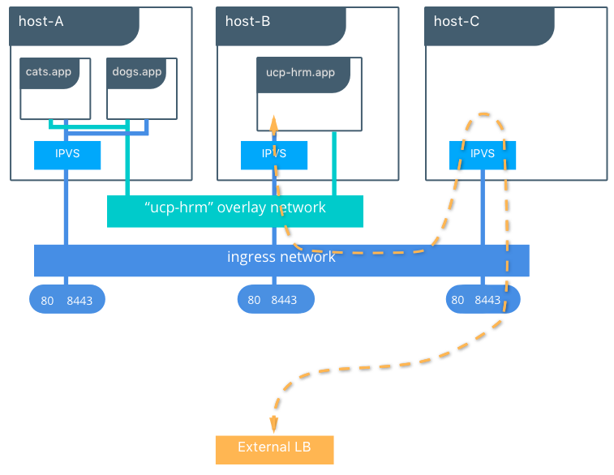

* 流量从外部负载均衡器流入 swarm mode 网格路由。
* HRM 服务配置为侦听端口 80 和 8443，因此任何对 UCP 集群的端口 80 或 8443 的请求都会流向 HRM 服务。
* 所有连接到经启用可实现“基于主机名的路由”的网络的服务都可使用 HRM 来基于 HTTP `Host:` 标头路由流量。

仔细看，您就会了解 HRM 的工作过程。下图对上一图表中表示的工作原理进行了更详细的说明。

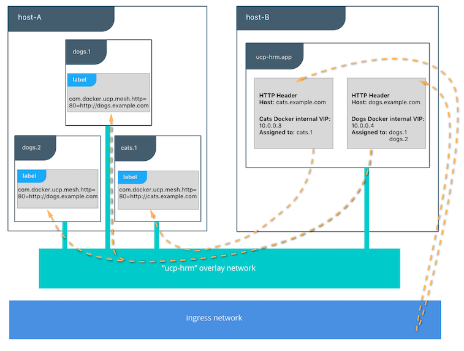

* 流量经由`入口`网络上的 swarm mode 网格路由流向 HRM 服务的已发布端口。
* 创建服务时，会在 swarm mode 网格路由 (L4) 上向它们分配 VIP。
* HRM 接收 TCP 数据包并检查 HTTP 标头。
    * 将检查包含 `com.docker.ucp.mesh.http` 标记的服务来查看它们是否与 HTTP `Host:` 标头匹配。
    * 如果 `Host:` 标头和服务标记匹配，就会使用 swarm mode 网格路由 (L4) 将流量路由到服务的 VIP。
* 如果服务包含多个从节点，那么将使用内部 L4 网格路由通过轮询对每个从节点容器进行负载均衡。

### HRM 和 Swarm Mode 网格路由的差异

HRM 和 swarm mode 网格路由的主要差异在于 HRM 仅能够在应用层上供 HTTP 流量使用，而 swarm mode 网格路由在较靠下的传输层上工作。

根据应用来决定使用哪种网格路由。如果应用需要被公开访问且为 HTTP 服务，那么 HRM 就非常适合。如果需要进行双向 TLS 认证才可访问后端应用，那么使用传输层可能会更加适合。

使用 HRM 的另一项优势在于仅需较少的配置就可将流量路由到服务。通常，在服务上设置标记时仅需一条 DNS 记录。如果使用了通配符 DNS 记录，那么除设置服务标记之外，就无需进行其他配置。在很多组织中，通常会限制对负载均衡器和 DNS 进行访问。如果仅通过服务标记就可控制对应用的请求，开发人员就能够快速循环访问更改。对于 swarm mode 网格路由，可以配置任意前端负载均衡器来将流量发送到服务的已发布端口。

下面的图表显示了使用通配符 DNS 的示例：

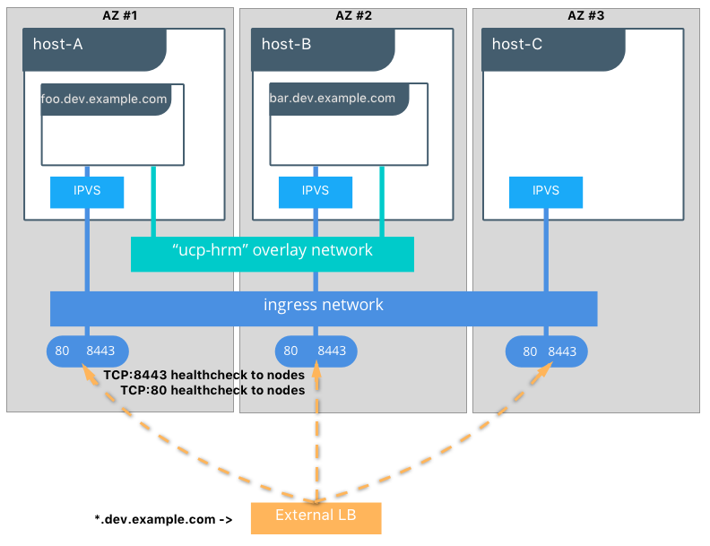

### 启用 HRM

可从 UCP Web 控制台启用 HTTP 网格路由。要启用它：

1. 登录 UCP Web 控制台。
2. 浏览至**管理员设置** > **网格路由**。
3. 选中**启用 HTTP 网格路由**。
4. 配置 HRM 要侦听的端口，默认值为 80 和 8443。HTTPS 端口默认为 8443，这样它就不会和默认 UCP 管理端口 (443) 互相干扰。

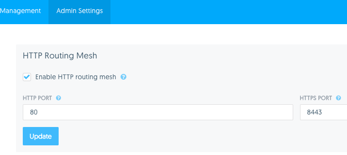

启用后，UCP 会在 swarm 集群上创建服务来基于 HTTP `Host:` 标头将流量路由到指定的容器。由于 HRM 服务是 *swarm mode* 服务，UCP 集群中的每个节点都可通过接收来自端口 `80` 和 `8443` 的流量来将流量路由到 HRM。HRM 服务在集群范围内公开端口 80 和 8443，任何通过端口 80 和 8443 发送的对集群的请求都会发送到 HRM。

### 网络和访问控制

HTTP 网格路由使用一个或多个 overlay 网络来与后端服务进行通信。默认情况下会创建名为 `ucp-hrm` 的单个网络，访问控制标记为 `ucp-hrm`。要向该网络添加服务，需要具备管理员级别的访问权限，或用户必须属于具有 `ucp-hrm` 访问权限的组。

该默认配置无法对使用 HTTP 网格路由的各个服务进行隔离，因为各个服务共享 `ucp-hrm` 网络。

要对服务实施隔离，必须在启用 HTTP 网格路由前使用 `com.docker.ucp.mesh.http` 标记创建一个或多个 overlay 网络。HRM 启用后，它可以路由到连接到这些网络的所有服务，但是不同网络上的服务不能直接通信。要使 HRM 在新的网络上可用，唯一方法是禁用并重新启用 HRM。

以下为创建包含 `com.docker.mesh.http` 标记的 overlay 网络的示例。对管理员用户或具有管理员权限的用户使用 UCP 客户端证书包时，请运行以下命令：

    docker network create -d overlay --label com.docker.ucp.mesh.http=true new-hrm-network

也可使用 UCP UI 达到相同的目的，方法是在创建网络时选择**启用基于主机名的路由**。

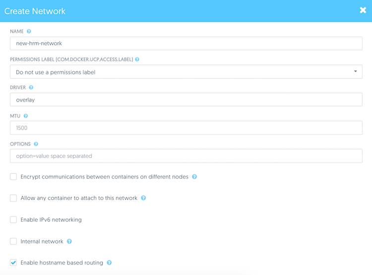

### HRM 要求

要使用 HRM，服务需要满足三个要求。

1. 服务必须连接到具有 `com.docker.ucp.mesh.http` 标记的网络
2. 服务必须发布一个或多个端口
3. 服务必须包含一个或多个带有前缀 `com.docker.ucp.mesh.http` 的标记，以指定要路由的端口

### 针对 HRM 配置 DNS

该部分介绍如何为使用 HRM 的服务配置 DNS。要使用 HRM，服务的 DNS 记录需要指向 UCP 集群。由于 swarm mode 网格路由提供了灵活性，可通过多种不同的方式配置服务的 DNS 记录。

如果服务需要可以被公开访问才可将请求发送到 `foo.example.com`，那么可以通过以下任何一种方式配置服务的 DNS 记录：

1. 将 DNS 配置为指向 UCP 集群上的任何一个节点。对于 `foo.example.com` 的所有请求都将通过该节点路由到 HRM。
2. 配置轮询 DNS 来指向 UCP 集群上的多个节点。任何收到对于 `foo.example.com` 的请求的节点都将通过 HRM 被路由。
3. **最佳**解决方案（为实现**高可用性**）是在 UCP 集群的前端配置外部 HA 负载均衡器。使用外部 HA 负载均衡器时需要牢记以下注意事项：
    * 将 `foo.example.com` 的 DNS 记录设置为指向外部负载均衡器。
    * 外部负载均衡器应指向驻留在不同的可用性区域中的多个 UCP 节点，以增强可恢复性。
    * 配置外部负载均衡器来对 HRM 服务的已配置的已发布端口执行 TCP 运行状况检查，以便通过运行状况良好的 UCP 节点路由流量。

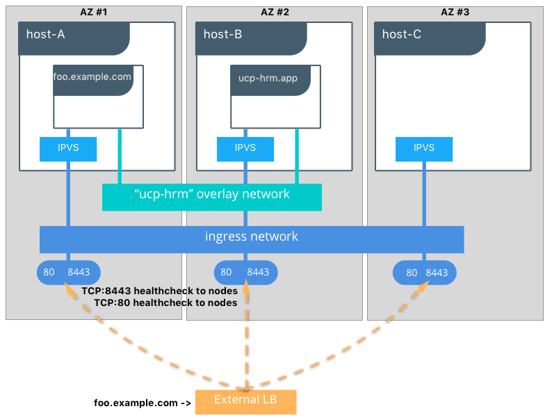

应该使用哪些节点来路由流量？管理节点还是工作节点？针对此问题的回答有好几种。

1. 对于规模较小的部署，可通过管理节点来路由流量，因为管理节点通常为静态性质。
    * **优势**：它们通常不会（在新主机、新 IP 等之间）经常变动，所以易于使负载均衡器指向相同的节点。
    * **缺点**：它们负责路由控制平面流量。如果应用流量较多，采用这种方法可能会使这些节点上的流量饱和，从而给集群带来不利影响。
2. 通过工作节点路由流量
    * **优势**：它们不管理整个集群，因此额外网络开销较少。
    * **缺点**：它们属于“cattle”节点。如果负载均衡器指向工作节点，围绕销毁和构建节点构建自动化时需要考虑这一点。

无论前端负载均衡器将流量指向哪种类型的实例，都需要确保实例具有足够的网络连接。

## HRM 用法

现在您已经了解了 HRM 的工作原理和与它相关的要求，本部分将介绍用于 HTTP 路由、日志记录、监控和从节点的 HRM 语法。

### HTTP 路由

服务必须包含一个标记，其标记键以 `com.docker.ucp.mesh.http` 开头。如果服务需要公开多个端口，那么可以使用多个标记，例如，`com.docker.ucp.mesh.http.80` 和 `com.docker.ucp.mesh.http.443`。`80` 和 `443` 用来通过端口号区别 HRM 标记。您可以使用任何值，只要确保它们彼此不同并且您可以跟踪它们即可。

连接到 HRM 使用的服务的标记键必须以 `com.docker.ucp.mesh.http` 开头，例如，`com.docker.ucp.mesh.http.80` 和 `com.docker.ucp.mesh.http.443`。

标记的值是以逗号分隔的键/值对（以等号分隔）列表。可以使用以下对：

* `external_route` **（必需）** — 要路由到该服务的外部 URL。示例：`[http://myapp.example.com](http://myapp.example.com "http://myapp.example.com")` 和 `[sni://myapp.example.com](sni://myapp.example.com "sni://myapp.example.com")`
* `internal_port` — 用于服务的内部端口。如果服务发布多个端口，此为**必需**。示例：`80` 和 `8443`
* `sticky_sessions` — 如果存在，使用该命名的 cookie 来将用户路由到此服务的相同后端任务。将会在本文档后面的 *Sticky Sessions* 部分对它进行详细说明。
* `redirect` — 如果存在，执行到指定 URL 的重定向。请参阅本文档后面的*重定向*部分。

### 日志记录

可通过执行以下步骤来记录经过 HRM 的流量：

1. 在 UCP UI 中，转至**管理员设置** -> **日志**。

2. 将**日志严重级别**设置为**调试**。

    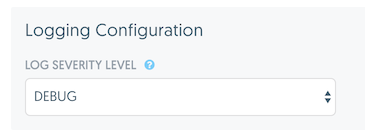

3. 更新 HRM 服务器来使用任何可用的 [Docker 日志记录驱动程序](https://docs.docker.com/engine/admin/logging/overview/)。以下是使用`系统日志`驱动程序的示例：

`docker service update --log-driver=syslog --log-opt syslog-address=udp://<ip_address>:514 ucp-hrm`

### 监控

要从前端负载均衡器监控 HRM，使用 TCP 运行状况检查将负载均衡器设置为监控集群上的已公开的 HRM 端口。如果将 HRM 配置为侦听默认端口 `80` 和 `8443`，那么前端负载均衡器仅需要对其池中的所有节点执行 TCP 运行状况检查即可。

### HRM HA 注意事项

本部分将讨论 HRM 的几个使用注意事项。

如果使用粘性会话功能，无法在所有从节点间共享被 HRM 用于实现持久化的 stick table — 因此，只能运行 HRM 的一个从节点。换句话说，如果使用基于 cookie 的持久化，HRM 只能作为一个从节点运行。

如果仅使用 HTTP 路由（无粘性会话）和 HTTPS 路由，那么出于 HA 目的，可将 HRM 扩展到多个从节点。

如果无需使用基于 cookie 的持久化，可将 HRM 服务扩展到多个从节点。例如，要使用 3 个从节点：

    docker service update --replicas 3 ucp-hrm

## HRM 用法示例

本部分将介绍使用所有可用的 HRM 网络模型的以下类型的应用：

* HTTP 路由
* 粘性会话
* HTTPS
* 多个端口
* 重定向

要练习这些展示服务发现和负载均衡的示例，必须满足以下条件：

1. 安装了具有 UCP 客户端证书包的 Docker 客户端，而且其可以与 UCP 集群通信。
2. 指向负载均衡器的 DNS 位于 UCP 集群前端。如果无负载均衡器可供使用，那么请将本地主机文件中的条目指向 UCP 集群中的主机。如果要直接连接到 UCP 集群中的主机，请使用已发布的 HRM 端口（默认 80 和 8443）连接它们。

> **注：**可在 [GitHub](https://github.com/ahromis/spring-session-docker-demo)上找到示例应用的镜像仓库。

### HTTP 路由示例

考虑展示 Docker EE 中的服务发现和负载均衡的示例应用。

要部署应用应用栈，在加载了 UCP 客户端证书包的情况下运行以下命令：

    $ wget https://raw.githubusercontent.com/ahromis/spring-session-docker-demo/master/ucp-demo/docker-compose.hrm.http.yml
    $ DOMAIN=<domain-to-route> docker stack deploy -c docker-compose.hrm.http.yml hrm-http-example

然后访问示例应用，网址为 `http://<domain-to-route>`，并使用**用户名：**`user` 和**密码：**`password` 登录。

如果您仅想复制/粘贴到 UCP UI，此为 Compose 文件的内容：

    version: “3.1"

    services:
        redis:
          image: redis:3.0.7
          hostname: redis
          networks:
            - back-end
          deploy:
            mode: replicated
            replicas:1
        session-example:
          image: ahromis/session-example:0.1
          ports:
            - 8080
          networks:
            - back-end
            - ucp-hrm
          deploy:
            mode: replicated
            replicas:5
            labels:
              - com.docker.ucp.mesh.http.8080=external_route=http://${DOMAIN},internal_port=8080

    networks:
      back-end:
        driver: overlay
      ucp-hrm:
        external:
          name: ucp-hrm

可通过 UCP UI 转至**资源** -> **应用栈和应用** -> **部署**进行部署。对应用栈进行命名，然后复制上面的 compose 文件并将其粘贴到开放文本字段。通过 UI 部署时，请务必替换 `${DOMAIN}` 变量。

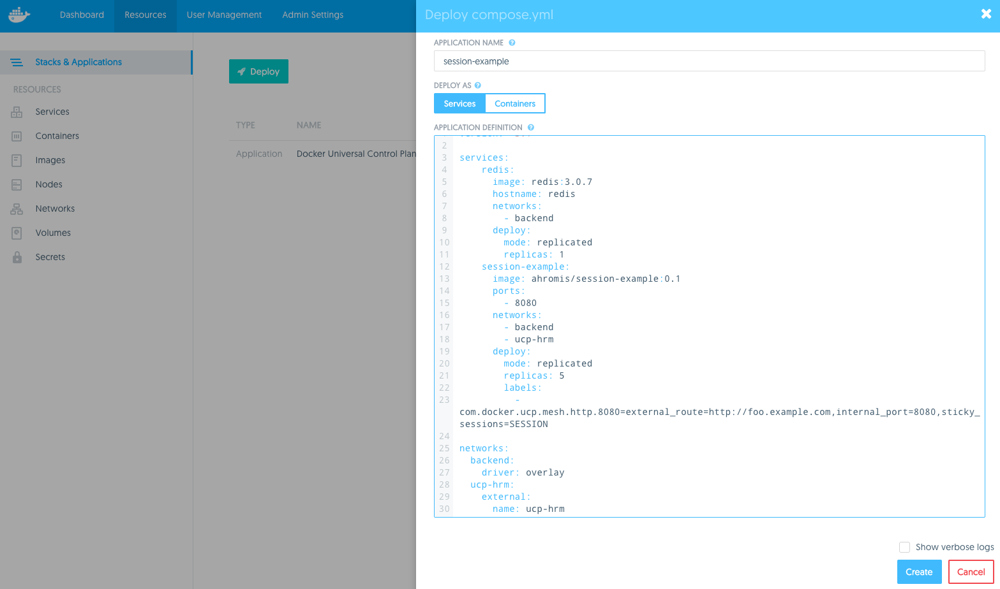

HRM 一旦发现新建服务，就会在 UCP 中将其列出。转至**管理员设置** -> **网格路由**。新应用应在**已配置的主机**下列出。

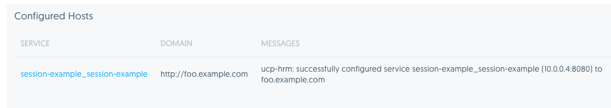

#### HRM 服务部署详解

HRM 每 30 秒进行一次轮询，因此应用一启动，HRM 就会对新服务进行轮询并在 `http://<domain-to-route>` 发现它。

部署 compose 文件时，会出现以下情况：

1. 将创建两个服务，前端 Spring Boot 应用和存储会话数据的 Redis 服务。
2. 将创建特定于此特定应用应用栈的新 overlay 网络，名称为 `<stack-name>_backend`。
3. 该 Redis 任务将创建 `redis` 的 DNS 记录（在 `backend` 网络上）。该 DNS 记录指向 Redis 容器的 IP 地址。
    * 前端应用的配置无需在访问 Redis 时为每个应用栈更改。对于每个环境，在应用配置中，它都保持为 `spring.redis.host=redis`。
4. 然后前端服务名称的 DNS 条目 `session-example` 将在 `ucp-hrm` 网络上注册。
5. 前端服务将创建并将连接到 `ucp-hrm` 服务。
6. 已声明的服务的良好运行状态为 5 个从节点，因此将会创建 5 个从节点任务。
7. HRM 每 30 秒对 Docker 事件进行轮询，并且它将拾取新建服务上的 `com.docker.ucp.mesh.http.8080` 标记。
8. HRM 将创建一个条目，使所有的 5 个前端从节点根据为应用栈部署而传递的 `$DOMAIN` 环境变量进行负载均衡。
9. 通过在 Web 浏览器中刷新 `[http://$DOMAIN](http://$DOMAIN "http://$DOMAIN")`，每次请求发送后都会显示新的主机名。它会在所有前端服务从节点间进行负载均衡。
10. 单击链接登录。凭据是**用户名：**`user`、**密码：**`password` 登录。

### HRM 粘性会话示例

HTTP 网格路由能够基于命名的 cookie 路由到特定的后端服务。例如，如果应用使用名称为 `JSESSIONID` 的 cookie 作为会话 cookie，您可以通过将 `sticky_sessions=JSESSIONID` 传递到 HRM 标记来持久存储到特定服务从节点任务的连接。在 HRM 中，粘性连接通过使用 stick table 来完成，其中，HRM 将发现并使用应用会话 cookie 来持久存储与特定后端从节点的连接。

为何需要使用基于 cookie 的持久化？它可以减少负载均衡器上的负载。负载均衡器拾取后端池中的特定实例并保持连接，而非必须在有新请求时重新路由。另外一个应用场景可以针对滚动部署。当将新的应用服务器引入负载均衡器池中时，新实例不会产生惊群效应。相反，随着会话到期它会谨慎地将到新实例的连接转变为负载均衡。

总体而言，粘性会话更适合于提高缓存性能和减少系统特定方面的负载。如果因为应用未使用分布式存储，需要每次都命中同一后端，那么当 Swarm Mode 重新调度任务时，您将在未来碰到更多问题。请务必在使用应用基于 cookie 的持久化时牢记这一点。

> **注：**使用 HTTPS 时粘性会话将不可用，因为 cookie 的值将在 HTTP 标头中加密。

要为粘性会话部署示例应用应用栈，在加载 UCP 客户端证书包的情况下运行以下命令：

    wget https://raw.githubusercontent.com/ahromis/spring-session-docker-demo/master/ucp-demo/docker-compose.hrm.sticky.yml
    DOMAIN=<domain-to-route> docker stack deploy -c docker-compose.hrm.http.yml hrm-sticky-example

访问示例应用，网址为 `http://<domain-to-route>`，并使用**用户名：**`user`、**密码：**`password` 登录。

如果您想复制/粘贴到 UCP UI 中，此为 compose 文件的内容：

    version: "3.1"

    services:
        redis:
          image: redis:3.0.7
          hostname: redis
          networks:
            - back-end
          deploy:
            mode: replicated
            replicas:1
        session-example:
          image: ahromis/session-example:0.1
          ports:
            - 8080
          networks:
            - back-end
            - ucp-hrm
          deploy:
            mode: replicated
            replicas:5
            labels:
              - com.docker.ucp.mesh.http.8080=external_route=http://${DOMAIN},internal_port=8080,sticky_sessions=SESSION

    networks:
      back-end:
        driver: overlay
      ucp-hrm:
        external:
          name: ucp-hrm

通过 UI 部署时，请务必替换 `${DOMAIN}` 变量。

#### HRM 粘性会话详解

访问和登录应用时,您应看到与下图类似的页面。

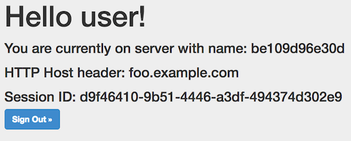

这与 HTTP 路由示例相同，但是具有附加的 `sticky_sessions=SESSION` 键值条目。

将 `sticky_sessions` 添加到 `com.docker.ucp.mesh.http` 具有什么作用？

1. HRM 将创建一个条目，使所有 5 个前端从节点的 IP 都添加到配置中。除该配置之外，还将添加作为持久化的基础的会话 cookie 的名称。
2. 在 Web 浏览器中加载 `[http://$DOMAIN](http://$DOMAIN "http://$DOMAIN")`，并使用**用户名：**`user`、**密码：**`password` 登录。对于粘性会话，刷新页面应显示同一后端服务器。到后端实例的连接将基于 `SESSION` cookie 的值持久存储。

该演示应用使用 Redis 作为会话数据的分布式存储。可以通过在 UCP UI 中打开到 Redis 容器的控制台来查看存储在 Redis 中的 `SESSION` cookie。

1. 登录 UCP UI。
2. 在左侧导航窗格中单击**应用栈和应用**。
3. 从列表中选择应用栈。
4. 从列表中选择 redis 服务。
5. 单击顶部的**任务**。
6. 选择 Redis 容器。
7. 单击顶部的**控制台**。
8. 使用 `sh` 来连接到控制台应用栈。
9. 在控制台上运行 `redis-cli keys "*"`。

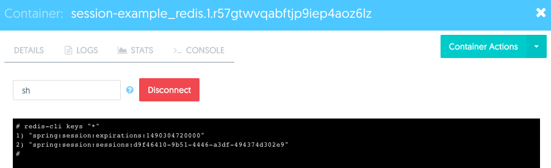

### HRM HTTPS 示例

HTTP 网格路由支持使用 HTTPS 的路由。使用称作*服务器名称指示*的 HTTPS 功能，HRM 无需终止 HTTPS 连接就能够将连接路由到服务后端。SNI 是 TLS 协议的一个扩展，其中，客户端在握手过程开始的时候就指示它尝试连接到的主机名。

要使用 HTTPS 支持，无需向 HTTP 网格路由提供服务的证书。相反，后端服务必须直接处理 HTTPS 连接。满足该条件的服务才可使用 SNI 协议来指示以这种方式进行 HTTPS 处理。由于到应用服务器才终止，加密流量可以一直流向应用。但是，这也意味着应用必须管理 TLS 证书。通过利用 Docker 涉密信息，可以轻松安全地管理应用服务器的证书。

将 HRM 和 HTTPS 搭配使用时，会重复使用连接以降低重新协商新的 TLS 连接的开销。通过使用 SSL 会话 ID 可重复使用 HTTPS 连接，它们将持久存储到服务任务，直至需要重新建立连接（即，应用服务器连接超时）。

处理加密通信时几乎一定会用到涉密信息和证书。在部署示例应用前，请先创建 Java 密钥存储。

> **提示：**下面是一些有用的命令，可创建可用于 Java 应用的密钥存储。

    # create PKCS#12 file format
    $ openssl pkcs12 -export -out keystore.pkcs12 -in fullchain.pem -inkey privkey.pem
    # convert PKCS file into Java keystore format
    $ docker run --rm -it -v $(pwd):/tmp -w /tmp java:8 \
        keytool -importkeystore -srckeystore keystore.pkcs12 -srcstoretype PKCS12 -destkeystore keystore.jks

现在已经创建好了 Java 密钥存储，接下来就该将其转换为 Docker 涉密信息，这样该应用就可以安全地使用它了。

    $ docker secret create session-example_keystore.jks_v1 keystore.jks
    $ echo "<your-key-store-password>" | docker secret create session-example_keystore-password.txt_v1 -
    $ echo "<your-key-password>" | docker secret create session-example_key-password.txt_v1 -

就是这样！现在涉密信息就在集群范围内的键值存储中加密了。涉密信息采用静态加密方法加密，将在移动到需要涉密信息的节点的过程中使用 TLS。只有需要使用涉密信息的应用才可查看涉密信息。

> **提示：**有关使用 Docker 涉密信息的更多详细信息，请参阅涵盖 [DDC 安全和最佳实践](https://success.docker.com/Architecture/Docker_Reference_Architecture%3A_Securing_Docker_EE_and_Security_Best_Practices#Secrets)的参考架构。

要添加更多上下文，这是示例应用使用的应用配置：

    spring.redis.host=redis
    spring.redis.port=6379
    server.port=8443
    server.ssl.key-store=file:/run/secrets/keystore.jks
    server.ssl.key-store-password=${KEY_STORE_PASSWORD}
    server.ssl.key-password=${KEY_PASSWORD}

环境变量来自 `ENTRYPOINT` 脚本，它将读取涉密信息，然后将其公开给 Spring Boot。可在该应用的 [GitHub 镜像仓库](https://github.com/ahromis/spring-session-docker-demo)中找到更多信息。

现在证书已安全创建并存储在 Docker KV 存储中，接下来该创建能够使用它们的服务了：

    wget https://raw.githubusercontent.com/ahromis/spring-session-docker-demo/master/ucp-demo/docker-compose.hrm.ssl.yml
    DOMAIN=<domain-to-route> docker stack deploy -c docker-compose.hrm.http.yml hrm-sticky-example

访问示例应用，网址为 `https://<domain-to-route>`。如果未使用置于 UCP 集群前端的负载均衡器，那么请使用 `https://<domain-to-route>:8443`。然后使用**用户名：**`user`、**密码：**`password` 登录。

如果想从 UI 进行复制/粘贴，下面是完整的 compose 文件（请记得替换 `${DOMAIN}` 变量）：

    version: "3.1"

    services:
        redis:
          image: redis:3.0.7
          hostname: redis
          networks:
            - back-end
          deploy:
            mode: replicated
            replicas:1
        session-example:
          image: ahromis/session-example:0.1
          ports:
            - 8443
          environment:
            - SPRING_PROFILES_ACTIVE=https
          networks:
            - back-end
            - ucp-hrm
          deploy:
            mode: replicated
            replicas:5
            labels:
              - com.docker.ucp.mesh.http.1=external_route=http://${DOMAIN},redirect=https://${DOMAIN}
              - com.docker.ucp.mesh.http.8443=external_route=sni://${DOMAIN},internal_port=8443
          secrets:
            - source: session-example_keystore.jks_v1
              target: keystore.jks
              mode:0400
            - source: session-example_keystore-password.txt_v1
              target: keystore-password.txt
              mode:0400
            - source: session-example_key-password.txt_v1
              target: key-password.txt
              mode:0400

    networks:
      back-end:
        driver: overlay
      ucp-hrm:
        external:
          name: ucp-hrm

    secrets:
        session-example_keystore.jks_v1:
            external: true
        session-example_keystore-password.txt_v1:
            external: true
        session-example_key-password.txt_v1:
            external: true

上面的示例也展示了如何通过使用 `redirect` 密钥对处理从 HTTP 到 HTTPS 的重定向。

值得一提的一点是，它非常易于重复使用，即使对现有应用也是如此。只需几个简单步骤就可执行 Modernize Traditional Applications (MTA)，而且只需进行少量配置更改就可多次部署该应用应用栈。

### HRM 多个端口示例

有时它可侦听服务的多个端口。借助 HRM，可独立路由到每个侦听端口。

下面是具有多个侦听端口的服务的示例：

    $ docker service create \
      -l com.docker.ucp.mesh.http.8000=external_route=http://site1.example.com,internal_port=8000 \
      -l com.docker.ucp.mesh.http.8001=external_route=http://site2.example.com,internal_port=8001 \
      -p 8000 \
      -p 8001 \
      --network ucp-hrm \
      --replicas 3 \
      --name twosite ahromis/nginx-twosite:latest

在本示例中，创建了一个 Nginx 服务，它有两个侦听不同端口的 Web 根目录。HRM 基于它收到的 HTTP `Host:` 标头独立地将流量路由到每个站点。

### HRM 重定向示例

当要强制使所有连接都成为安全连接时，可从 HTTP 重定向到 HTTPS。该重定向选项指示对该路由的所有请求都应使用 HTTP 重定向重定向到其他域名。

此功能的一个用途是用于仅使用 HTTPS 进行侦听的服务（HTTP 流量将重定向到 HTTPS）。如果该服务位于 example.com 上，那么可以使用两个标记来完成：

    com.docker.ucp.mesh.http.1=external_route=http://example.com,redirect=https://example.com
    com.docker.ucp.mesh.http.2=external_route=sni://example.com

另外一个用途是用于只接收单个域上的流量，但是有其他域会重定向到它的服务。例如，一个重命名后的网站可能会使用该功能。下面的标记可为 `new.example.com` 和 `old.example.com` 实现此效果。

    com.docker.ucp.mesh.http.1=external_route=http://old.example.com,redirect=http://new.example.com
    com.docker.ucp.mesh.http.2=external_route=http://new.example.com

下面是使用不同的示例应用将网站重定向到不同的域的示例。

    $ docker service create \
      -l com.docker.ucp.mesh.http.1=external_route=http://oldsite.example.com,redirect=http://foo.example.com \
      -l com.docker.ucp.mesh.http.8080=external_route=http://foo.example.com,internal_port=8080 \
      --replicas 3 \
      --name lbinfo \
      ahromis/lbinfo:latest

## 非 Swarm Mode 容器

HRM 和 swarm mode 网格路由仅支持使用“服务”部署的应用。对于非 swarm mode 容器，例如，在 1.12 版本之前的 Docker 引擎上运行的容器和未使用服务部署的应用（例如，使用 `docker run`），必须使用 [interlock](https://github.com/ehazlett/interlock) 和 NGINX。

Interlock 是容器化的、事件驱动的工具，它连接到 UCP 控制器并监视事件。在这种情况下，事件指的是容器激增或骤减。Interlock 还会查找这些容器具有的特定元数据，例如，主机名或为容器配置的标记。然后，它使用元数据将这些容器注册到负载均衡后端 (NGINX) 或取消注册。负载均衡器使用更新后的后端配置将传入请求导向运行状况良好的容器。Interlock 和负载均衡器容器都是无状态的，因此，可跨多个节点对它们进行横向扩展，以为所有已部署的应用提供高度可用的负载均衡服务。

要使用 Interlock 和 NGINX，容器需要满足三个要求：

**I. 需要在一个或多个 UCP 工作节点上部署 Interlock 和 NGINX。**

部署 Interlock 和 NGINX 最简单的方法是在 UCP 门户中使用 Docker Compose：

1. 登录 UCP Web 控制台。
2. 在顶部，转至**资源**选项卡。
3. 在左侧窗格中，转至**应用**，并单击**部署 compose.yml** 按钮。
4. 输入 `interlock` 作为**应用名称**。

5. 至于 `compose.yml` 文件，请输入下面的示例 `compose.yml` 文件。可按照需要更改 Interlock 或 NGINX config。可在 [GitHub](https://github.com/ehazlett/interlock/tree/master/docs) 上找到完整文档。

        interlock:
        	    image: ehazlett/interlock:1.3.0
        	    command:-D run
        	    tty: true
        	    ports:
        	        - 8080
        	    environment:
        	        constraint:node==${UCP_NODE_NAME}:
        	        INTERLOCK_CONFIG:|
        	            ListenAddr = ":8080"
        	            DockerURL = "tcp://${UCP_CONTROLLER_IP}:2376"
        	            TLSCACert = "/certs/ca.pem"
        	            TLSCert = "/certs/cert.pem"
        	            TLSKey = "/certs/key.pem"
        	            PollInterval = "10s"
        	            [[Extensions]]
        	            Name = "nginx"
        	            ConfigPath = "/etc/nginx/nginx.conf"
        	            PidPath = "/etc/nginx/nginx.pid"
        	            MaxConn = 1024
        	            Port = 80
        	    volumes:
        	        - ucp-node-certs:/certs
        	    restart: always

        	nginx:
        	    image: nginx:latest
        	    entrypoint: nginx
        	    command:-g "daemon off;" -c /etc/nginx/nginx.conf
        	    ports:
        	        - 80:80
        	    labels:
        	        - "interlock.ext.name=nginx"
        	    restart: always
        	    environment:
        	        constraint:node==${UCP_NODE_NAME}:

    > **注：**请替换 `UCP_NODE_NAME` 和 `UCP_CONTROLLER_IP`。`UCP_NODE_NAME` 是要在其上运行 Interlock 和 NGINX 的节点的名称（如**资源**/**节点**部分下所示）。应用的 DNS 名称需要解析到该节点。`UCP_CONTROLLER_IP` 是一个或多个 UCP 控制器的 IP 或 DNS 名称。

6. 单击**创建**来部署 Interlock 和 NGINX。

> **注：**可通过重复上述的步骤 3-6 并更改**应用名称**和 `UCP_NODE_NAME` 来在多个节点上部署 Interlock 和 NGINX。这使您可以在这些节点前端放置外部负载均衡器（例如，ELB 或 F5）以实现高可用性。然后需要将应用的 DNS 记录注册到外部负载均衡器 IP。

**II.容器必须发布一个或多个端口。**

**III.容器必须使用 Interlock [标记](https://github.com/ehazlett/interlock/blob/master/docs/interlock_data.md)启动。**

例如，要部署公开端口 `8080` 且通过 DNS 名称 `demo.app.example.com` 接受访问的容器，请按照下面的方法启动它。

    docker run --name demo -p 8080 --label interlock.hostname=demo --label interlock.domain=app.example.com ehazlett/docker-demo:dcus

使用正确的标记和已发布端口启动容器后，就可使用所需的 DNS 名称访问它。

## 总结

在 Docker 中，扩展和发现服务的功能比以往任何时候都更简单。由于服务发现和负载均衡功能已内置到 Docker 中，工程师可以节约亲自创建这些类型的支持功能的时间，从而将更多精力集中在应用上。无需创建调用设置的 DNS 的 API 就可实现服务发现，因为 Docker 会自动帮您处理。如果应用需要扩展，Docker 也会自动将其添加到负载均衡器池。借助这些功能，组织可以在更短的时间内交付高度可用的应用。
